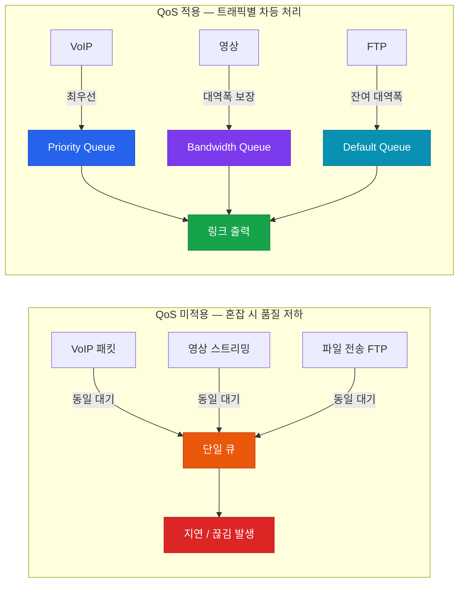

# QoS (Quality of Service) 개요

## 정의

네트워크에서 트래픽 유형별로 **전송 우선순위·대역폭·지연·손실**을 차등 제어하여, 음성·영상 같은 실시간 트래픽의 품질을 보장하는 일련의 메커니즘.

## 특징

- **(트래픽 차등 처리)** 트래픽 유형(VoIP, 영상, 데이터)에 따라 전송 우선순위와 자원을 다르게 할당하여 품질 보장
- **(혼잡 제어 메커니즘)** 폴리싱·셰이핑·큐잉·혼잡 회피 등의 도구를 조합하여 링크 포화 상황을 관리
- **(소프트웨어 정의 정책)** MQC(Modular QoS CLI) 기반으로 class-map → policy-map → service-policy 구조로 정책을 선언적으로 정의

## 왜 필요한가?

기업 네트워크에서 인터넷 링크가 혼잡해지면 VoIP 패킷과 대용량 파일 전송 패킷이 동일하게 대기열에 쌓인다. 결과적으로 통화 품질이 끊기거나 지연이 발생한다.

QoS는 트래픽 유형을 **분류(Classify) → 마킹(Mark) → 우선 처리(Queue/Schedule)**하는 파이프라인을 통해 실시간 트래픽은 먼저, 대용량 파일 전송은 나중에 처리하도록 보장한다.

---

## QoS 파이프라인

패킷은 입력부터 출력까지 아래 파이프라인을 순서대로 통과한다.

| 단계 | 역할 | 주요 도구 |
|------|------|-----------|
| **분류 (Classification)** | 트래픽 유형 식별 | ACL, NBAR, DSCP, CoS |
| **마킹 (Marking)** | 패킷에 QoS 값 설정 | DSCP, IP Precedence, CoS |
| **폴리싱 (Policing)** | 초과 트래픽 즉시 드롭/리마킹 | `police` 명령어 |
| **셰이핑 (Shaping)** | 초과 트래픽을 큐에 버퍼링 | `shape average` |
| **큐잉 (Queuing)** | 우선순위 대기열 배치 | CBWFQ, LLQ |
| **스케줄링 (Scheduling)** | 큐에서 패킷 꺼내는 순서 결정 | WFQ, PQ |

---

## 섹션 문서 링크

| 문서 | 주제 |
|------|------|
| [QoS 모델](./qos-models) | Best Effort / IntServ / DiffServ, MQC 구조 |
| [분류 & 마킹](./classification) | CoS, DSCP, IP Precedence, NBAR, Trust Boundary |
| [큐잉 메커니즘](./queuing) | FIFO, PQ, WFQ, CBWFQ, LLQ |
| [트래픽 셰이핑 & 폴리싱](./shaping-policing) | Token Bucket, CIR, 2색/3색 폴리싱 |
| [혼잡 회피](./congestion-avoidance) | Tail Drop, RED, WRED, ECN |

---

## CCNP/CCIE 시험 비중

QoS는 CCNP ENCOR(350-401) 시험에서 약 **10%** 비중을 차지한다.

| 출제 영역 | 주요 토픽 |
|-----------|-----------|
| QoS 모델 | DiffServ vs IntServ, DSCP 값 암기 (EF=46, AF 계열) |
| 분류·마킹 | Trust Boundary, `mls qos trust`, NBAR |
| 큐잉 | LLQ `priority` vs CBWFQ `bandwidth`, WFQ 기본 적용 조건 |
| 셰이핑/폴리싱 | Shaping 아웃바운드 전용, Policing 양방향 |
| 혼잡 회피 | TCP 글로벌 동기화, WRED 임계값 |

## CCNP/CCIE 시험 포인트

- QoS 파이프라인의 순서: **분류 → 마킹 → 폴리싱/셰이핑 → 큐잉 → 스케줄링**
- 마킹은 가능한 한 **네트워크 에지(Trust Boundary)** 에서 수행한다
- DiffServ(DSCP 기반)가 현재 표준이며, IntServ(RSVP)는 확장성 문제로 대규모 네트워크에서 사용하지 않는다
- MQC 3단계: `class-map` → `policy-map` → `service-policy`
