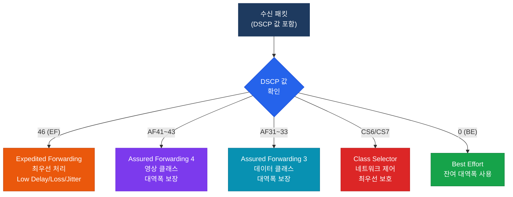

# QoS 모델

## 정의

네트워크 트래픽에 대해 품질 보장 수준을 정의하는 아키텍처 모델로, **Best Effort·IntServ·DiffServ** 세 가지가 있으며 현재 엔터프라이즈 표준은 DSCP 마킹 기반의 **DiffServ**다.

## 특징

- **(계층적 서비스 차등화)** 트래픽 클래스별로 서로 다른 수준의 전달 품질(지연·손실·대역폭)을 보장하여 중요도에 따른 자원 배분
- **(DiffServ 확장성)** 패킷 헤더의 DSCP 6비트 값만으로 클래스를 표현하여 라우터가 플로우 상태를 저장하지 않아도 되는 확장성 보장
- **(MQC 선언적 구조)** class-map으로 트래픽을 식별하고, policy-map으로 정책을 정의하며, service-policy로 인터페이스에 적용하는 3단계 선언적 설정

## Best Effort vs IntServ vs DiffServ 비교

| 구분 | Best Effort | IntServ | DiffServ |
|------|-------------|---------|----------|
| **품질 보장** | 없음 | 플로우별 완전 보장 | 클래스별 보장 |
| **메커니즘** | 없음 | RSVP 자원 예약 | DSCP 마킹 |
| **상태 관리** | 불필요 | 라우터가 플로우별 상태 저장 | 불필요 |
| **확장성** | 최고 | 매우 낮음 (플로우 수 비례) | 높음 |
| **복잡도** | 없음 | 높음 | 중간 |
| **표준** | — | RFC 1633 | RFC 2474/2475 |
| **사용 환경** | 일반 인터넷 | 소규모 전용망 | 엔터프라이즈/ISP 표준 |

---

## DiffServ DSCP 마킹 체계

DSCP(Differentiated Services Code Point)는 IPv4 ToS 필드의 상위 6비트를 사용하여 0~63 값으로 트래픽 클래스를 표현한다.

| DSCP 이름 | 10진수 값 | 2진수 (6비트) | 용도 |
|-----------|-----------|---------------|------|
| **EF** (Expedited Forwarding) | 46 | 101110 | VoIP RTP, 저지연 필수 트래픽 |
| **AF41** | 34 | 100010 | 영상 회의 (고우선) |
| **AF42** | 36 | 100100 | 영상 회의 (중우선) |
| **AF43** | 38 | 100110 | 영상 회의 (저우선) |
| **AF31** | 26 | 011010 | 중요 데이터 (고우선) |
| **AF32** | 28 | 011100 | 중요 데이터 (중우선) |
| **AF11** | 10 | 001010 | 일반 데이터 |
| **CS6** | 48 | 110000 | 네트워크 제어 (BGP, OSPF) |
| **CS7** | 56 | 111000 | 네트워크 제어 (최고) |
| **BE / CS0** | 0 | 000000 | Best Effort (기본값) |

> **AF(Assured Forwarding) 명명 규칙**: AFxy — x는 클래스(1~4), y는 드롭 우선순위(1=낮음, 3=높음)

---

## PHB (Per-Hop Behavior)

각 라우터/스위치가 DSCP 값을 보고 패킷에 적용하는 **홉별 전달 동작**이다.



---

## MQC (Modular QoS CLI) 구조

Cisco IOS의 QoS 설정 표준 구조다. 3단계로 구성된다.


---

## 설정 및 검증

```bash
! ── Step 1: 트래픽 분류 (class-map) ──────────────────────────────────
R(config)# class-map match-all VOIP-CLASS
R(config-cmap)#  match dscp ef               ! DSCP EF(46)인 패킷 매칭

R(config)# class-map match-all VIDEO-CLASS
R(config-cmap)#  match dscp af41             ! DSCP AF41(34)인 패킷 매칭

R(config)# class-map match-all DATA-CLASS
R(config-cmap)#  match dscp af31             ! DSCP AF31(26) 매칭

! ── Step 2: 정책 정의 (policy-map) ───────────────────────────────────
R(config)# policy-map WAN-QOS-POLICY
R(config-pmap)#  class VOIP-CLASS
R(config-pmap-c)#   priority 512            ! LLQ — 512 kbps 엄격 우선순위

R(config-pmap)#  class VIDEO-CLASS
R(config-pmap-c)#   bandwidth percent 30    ! 전체 대역폭의 30% 보장

R(config-pmap)#  class DATA-CLASS
R(config-pmap-c)#   bandwidth percent 20    ! 전체 대역폭의 20% 보장
R(config-pmap-c)#   set dscp af31           ! 마킹 재설정(선택)

R(config-pmap)#  class class-default
R(config-pmap-c)#   fair-queue              ! 나머지는 WFQ

! ── Step 3: 인터페이스 적용 (service-policy) ─────────────────────────
R(config)# interface GigabitEthernet0/0
R(config-if)#  service-policy output WAN-QOS-POLICY  ! 아웃바운드 적용

! ── 검증 명령어 ──────────────────────────────────────────────────────
R# show policy-map interface GigabitEthernet0/0   ! 정책 통계 확인
R# show class-map                                  ! class-map 목록 확인
R# show policy-map                                 ! policy-map 목록 확인
```

---

## CCNP/CCIE 시험 포인트

- **EF DSCP 값은 46 (101110)** — 반드시 암기, VoIP RTP에 사용
- **CS6(48)은 라우팅 프로토콜 제어 트래픽**용 — BGP/OSPF 패킷에 마킹
- IntServ는 **RSVP(Resource Reservation Protocol)** 기반이며 확장성 문제로 대규모 망에 부적합
- MQC에서 `match-all`은 AND 조건, `match-any`는 OR 조건
- `class class-default`는 어떤 class-map에도 매칭되지 않은 나머지 트래픽을 처리
- `priority` 명령어는 LLQ(Strict Priority), `bandwidth`는 CBWFQ — 혼동 주의
- AF 드롭 우선순위: **숫자가 클수록 혼잡 시 먼저 드롭** (AF13 > AF12 > AF11)
