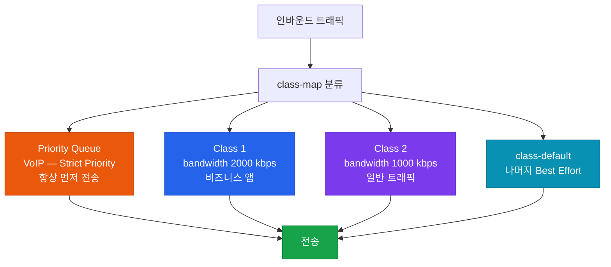

# 큐잉 메커니즘 (Queuing Mechanisms)

## 정의

네트워크 인터페이스 출력 버퍼에서 트래픽 혼잡 시 **대기 중인 패킷을 어떤 순서로 전송할지** 결정하는 스케줄링 알고리즘으로, 서비스 품질(QoS)의 핵심 메커니즘이다.

## 특징

- **(클래스별 대역폭 보장)** CBWFQ는 클래스마다 최소 보장 대역폭을 할당하여 혼잡 시에도 중요 트래픽이 굶주리지 않도록 보장
- **(LLQ Strict Priority)** VoIP 같은 지연에 민감한 트래픽을 위해 `priority` 명령어로 엄격한 우선 큐를 생성하여 항상 먼저 처리
- **(공정 대역폭 분배)** WFQ는 플로우별 가중치를 자동 계산하여 단일 플로우가 전체 대역폭을 독점하는 문제 방지

## 왜 필요한가?

단순 FIFO 큐는 대용량 데이터 전송이 VoIP 패킷을 수십~수백ms 지연시킨다. 큐잉 알고리즘은 트래픽 클래스별로 **처리 순서와 대역폭을 분리**하여 VoIP(지연 < 150ms), 화상회의, 비즈니스 앱, 일반 트래픽의 SLA를 동시에 만족시킨다.

---

## 큐잉 알고리즘 비교

| 알고리즘 | 큐 수 | 특징 | 기본 활성화 조건 |
|---------|------|------|----------------|
| FIFO | 1 | 선입선출, 최단 지연 | 고속 인터페이스 기본 |
| PQ (Priority Queuing) | 4 | High/Med/Normal/Low, High 고갈 가능 | 수동 설정 |
| CQ (Custom Queuing) | 16 | 라운드로빈, 큐별 바이트 수 지정 | 수동 설정 |
| WFQ (Weighted Fair Queuing) | 플로우 수 | 자동 플로우 가중치, IP Precedence 반영 | ≤ E1(2.048Mbps) 기본 |
| CBWFQ | 64 | MQC 클래스별 대역폭 보장 | 수동 설정 |
| LLQ | CBWFQ + Priority | Strict Priority + CBWFQ 결합 | 수동 설정 |

---

## LLQ 동작 구조



---

## 설정 및 검증

```bash
! 클래스 맵 정의
R(config)# class-map match-any VOIP
R(config-cmap)#  match dscp ef          ! DSCP 46 (EF)

R(config)# class-map match-any BUSINESS
R(config-cmap)#  match dscp af31 af32 af33

R(config)# class-map match-any BULK
R(config-cmap)#  match dscp af11 af12

! LLQ + CBWFQ 정책 맵
R(config)# policy-map WAN-OUT
R(config-pmap)#  class VOIP
R(config-pmap-c)#   priority 512         ! Strict Priority (LLQ) — kbps
R(config-pmap)#  class BUSINESS
R(config-pmap-c)#   bandwidth percent 40 ! 보장 대역폭 40%
R(config-pmap)#  class BULK
R(config-pmap-c)#   bandwidth percent 20
R(config-pmap)#  class class-default
R(config-pmap-c)#   fair-queue           ! WFQ for 나머지

! 인터페이스에 적용 (출력 방향)
R(config)# interface Serial0/0
R(config-if)#  service-policy output WAN-OUT

! 검증
R# show policy-map interface Serial0/0
R# show queue Serial0/0
R# show queueing
```

---

## CCNP/CCIE 시험 포인트

- LLQ는 `priority [kbps]` 명령어, CBWFQ는 `bandwidth [kbps]` — 혼동 금지
- `priority` 큐는 **Policer** 내장 — 지정 대역폭 초과 시 패킷 드롭 (버스트 제한)
- WFQ는 **E1(2.048Mbps) 이하** 인터페이스에서 기본 활성화
- `bandwidth percent` 합계가 100% 초과 시 설정 거부
- `class-default`는 항상 존재 — 명시하지 않아도 묵시적으로 적용
- PQ는 High 큐가 항상 먼저 → Low 큐 **기아(Starvation)** 문제 발생 가능
- CBWFQ는 혼잡이 없을 때 보장 대역폭 초과 사용 가능 (유휴 대역 공유)
