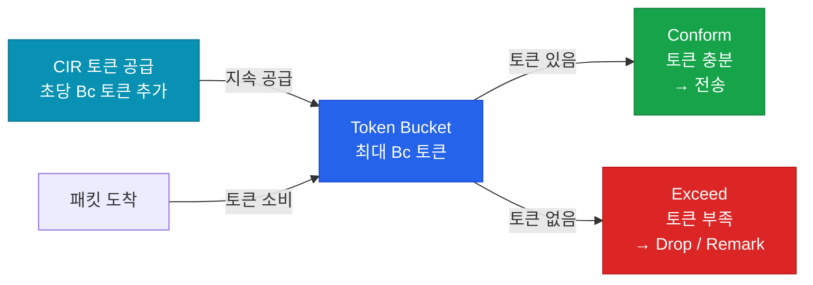

# 트래픽 셰이핑 & 폴리싱 (Shaping & Policing)

## 정의

네트워크 인터페이스에서 트래픽 속도를 제어하는 메커니즘으로, **폴리싱(Policing)** 은 초과 트래픽을 즉시 드롭/리마크하고, **셰이핑(Shaping)** 은 초과 트래픽을 버퍼에 저장 후 지정 속도로 평활화하여 전송한다.

## 특징

- **(폴리싱 — 즉각 제어)** 초과 트래픽을 즉시 드롭하거나 DSCP를 하향 마킹(remark)하며 인바운드·아웃바운드 모두 적용 가능
- **(셰이핑 — 버퍼 평활화)** 초과 트래픽을 큐에 버퍼링 후 CIR 속도로 천천히 전송하여 TCP 재전송 없이 속도 제한 — **아웃바운드 전용**
- **(Token Bucket 알고리즘)** CIR(Committed Information Rate)과 Bc(Burst Committed) 토큰으로 순간 버스트를 허용하면서 평균 속도를 CIR으로 유지

## 왜 필요한가?

ISP와 계약한 CIR을 초과하면 ISP가 트래픽을 드롭한다. 셰이핑으로 **디바이스 단에서 미리 속도를 제한**하면 ISP 드롭을 피하고 TCP 재전송을 최소화할 수 있다. 폴리싱은 사용자 트래픽이 SLA를 초과하지 않도록 강제 집행한다.

---

## Shaping vs Policing 비교

| 구분 | Policing | Shaping |
|------|---------|---------|
| 초과 트래픽 처리 | 즉시 드롭 / Remark | 버퍼 후 전송 |
| 방향 | 인바운드 + 아웃바운드 | 아웃바운드만 |
| 지연 추가 | 없음 | 있음 (버퍼링) |
| TCP 영향 | 재전송 유발 | 재전송 최소화 |
| 적용 위치 | 고객 진입 (ISP 측) | WAN 출력 |
| 버스트 | Bc, Be 제한 | Bc 허용 |

---

## Token Bucket 동작



---

## 2색 vs 3색 폴리싱

| 색상 | 기준 | 조건 | 액션 |
|------|------|------|------|
| 녹색 (Conform) | CIR 이내 | 토큰 충분 | transmit |
| 황색 (Exceed) | CIR~PIR 사이 | Bc 부족, Be 있음 | remark / transmit |
| 적색 (Violate) | PIR 초과 | Be도 없음 | drop |

> **2색**: Conform + Exceed만 (PIR 없음)
> **3색**: Conform + Exceed + Violate (PIR 추가, RFC 2698)

---

## 설정 및 검증

```bash
! === 폴리싱 (MQC) ===
R(config)# policy-map POLICE-IN
R(config-pmap)#  class class-default
R(config-pmap-c)#   police rate 10000000 bps   ! 10 Mbps CIR
R(config-pmap-c-police)#    conform-action transmit
R(config-pmap-c-police)#    exceed-action set-dscp-transmit af21  ! Remark
R(config-pmap-c-police)#    violate-action drop

R(config)# interface GigabitEthernet0/1
R(config-if)#  service-policy input POLICE-IN

! === 셰이핑 (MQC) ===
R(config)# policy-map SHAPE-OUT
R(config-pmap)#  class class-default
R(config-pmap-c)#   shape average 10000000     ! 10 Mbps 평균 속도

R(config)# interface GigabitEthernet0/0
R(config-if)#  service-policy output SHAPE-OUT

! === 클래스별 폴리싱 (계층적 정책) ===
R(config)# policy-map PARENT-SHAPE
R(config-pmap)#  class class-default
R(config-pmap-c)#   shape average 100000000    ! 100 Mbps 전체 셰이핑
R(config-pmap-c)#   service-policy POLICE-IN   ! 자식 정책

! 검증
R# show policy-map interface GigabitEthernet0/0
R# show policy-map interface GigabitEthernet0/1
```

---

## CCNP/CCIE 시험 포인트

- **셰이핑은 아웃바운드만** — 인바운드에 `shape`를 설정하면 오류
- **폴리싱은 양방향** — ISP가 인바운드 폴리싱으로 과금 트래픽 제어
- `shape average`는 평균 속도 유지, `shape peak`는 순간 최대 속도
- TCP는 드롭을 윈도우 축소 신호로 인식 — 폴리싱 드롭 → TCP 재전송 증가
- 3색 폴리싱에서 **Exceed는 remark 후 전송**, Violate는 drop이 일반적
- `police rate [bps]`와 `police [bps] [burst]` 두 가지 문법 혼재 — IOS 버전 주의
