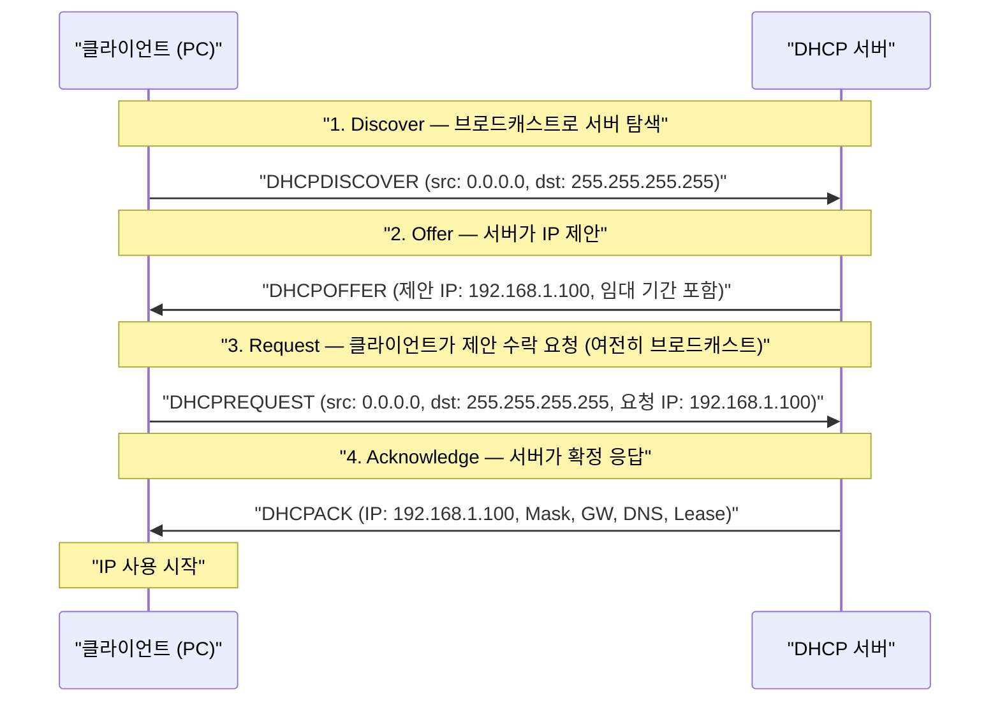
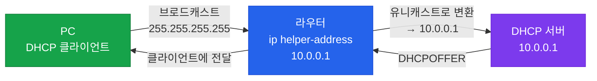

# DHCP (Dynamic Host Configuration Protocol)

## 정의

호스트가 네트워크에 연결될 때 IP 주소, 서브넷 마스크, 기본 게이트웨이, DNS 서버 등의 네트워크 구성 정보를 자동으로 할당하는 RFC 2131 기반 클라이언트-서버 프로토콜.

## 특징

- **(자동 주소 할당)** 관리자가 호스트마다 수동으로 IP를 설정하지 않아도 되므로 대규모 네트워크의 운영 부담을 대폭 경감
- **(임대(Lease) 기반 관리)** 할당된 IP는 지정된 기간 동안만 유효하며 만료 시 자동 갱신 또는 회수되어 주소 풀의 효율적인 재사용 가능
- **(DHCP Relay를 통한 중앙 집중 운용)** `ip helper-address`로 브로드캐스트를 유니캐스트로 전환해 원격 서브넷에도 단일 DHCP 서버 적용 가능

## DHCP DORA 흐름



> DORA 이후 임대 갱신(T1=50%, T2=87.5%)은 **유니캐스트**로 진행된다.

## DHCP Relay

DHCP 클라이언트와 서버가 서로 다른 서브넷에 있을 경우, 브로드캐스트가 라우터를 넘어가지 못한다. **DHCP Relay Agent(ip helper-address)** 가 브로드캐스트를 유니캐스트로 변환하여 원격 DHCP 서버로 전달한다.



## DHCPv6

IPv6 환경에서는 **SLAAC(Stateless Address Autoconfiguration)** 와 **DHCPv6** 두 가지를 혼용하거나 단독 사용한다.

| 구분 | DHCPv6 Stateful | DHCPv6 Stateless |
|------|----------------|-----------------|
| IPv6 주소 할당 | DHCPv6 서버가 직접 할당 (IA_NA) | SLAAC이 담당 |
| DNS·도메인 제공 | DHCPv6 서버 제공 | DHCPv6 서버 제공 |
| RA 플래그 | M=1, O=1 | M=0, O=1 |
| 상태 관리 | 서버가 바인딩 추적 | 서버는 옵션만 제공 |

> **M 플래그(Managed)** = 1: DHCPv6에서 주소 받아라 / **O 플래그(Other)** = 1: DHCPv6에서 DNS 등 옵션 받아라

## 설정 및 검증

### DHCP 서버 설정 (Cisco IOS)

```bash
! 제외 주소 지정 (게이트웨이, 서버 등 고정 IP)
R1(config)# ip dhcp excluded-address 192.168.1.1 192.168.1.10

! DHCP 풀 정의
R1(config)# ip dhcp pool OFFICE_LAN
R1(dhcp-config)# network 192.168.1.0 /24       ! 할당 네트워크
R1(dhcp-config)# default-router 192.168.1.1    ! 기본 게이트웨이
R1(dhcp-config)# dns-server 8.8.8.8 8.8.4.4   ! DNS 서버
R1(dhcp-config)# lease 7                        ! 임대 기간 7일 (기본 1일)
R1(dhcp-config)# domain-name example.com
```

### DHCP Relay 설정 (클라이언트 쪽 인터페이스에 적용)

```bash
R1(config-if)# ip helper-address 10.0.0.1       ! DHCP 서버 IP 지정
```

### DHCPv6 Stateless 설정

```bash
! DHCPv6 풀 정의 (DNS 옵션만 포함)
R1(config)# ipv6 dhcp pool IPV6_STATELESS
R1(config-dhcpv6)# dns-server 2001:4860:4860::8888
R1(config-dhcpv6)# domain-name example.com

! RA에서 O 플래그 활성화 (M=0, O=1)
R1(config-if)# ipv6 nd other-config-flag
R1(config-if)# ipv6 dhcp server IPV6_STATELESS
```

### 검증 명령어

```bash
R1# show ip dhcp binding              ! 할당된 IP와 클라이언트 MAC 확인
R1# show ip dhcp pool                 ! 풀별 사용/가용 주소 수
R1# show ip dhcp conflict             ! IP 충돌 감지 목록
R1# show ip dhcp statistics           ! 메시지 통계 (Discover/Offer/Request/Ack 카운터)
R1# debug ip dhcp server events       ! DHCP 서버 이벤트 실시간 확인
```

## CCNP/CCIE 시험 포인트

- `ip dhcp excluded-address`는 **풀 정의 전에** 설정해야 제외가 정상 적용됨
- DHCP Relay(`ip helper-address`)는 DHCP 뿐 아니라 TFTP·DNS·TACACS 등 8가지 UDP 서비스도 릴레이 (기본값)
- DHCPv6 Stateful: **M 플래그 = 1** (RA에서 `ipv6 nd managed-config-flag`)
- DHCPv6 Stateless: **O 플래그 = 1**, M = 0 (RA에서 `ipv6 nd other-config-flag`)
- DORA 중 Discover와 Request는 **브로드캐스트**, Offer와 Ack는 **유니캐스트 또는 브로드캐스트** (클라이언트 상태에 따라)
- 임대 갱신: T1(50% 시점)에 서버에 유니캐스트 Request, T2(87.5%)에도 갱신 실패 시 브로드캐스트 재시도
