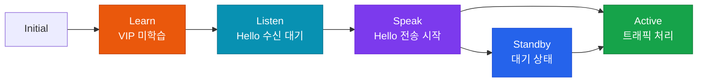

# FHRP (First Hop Redundancy Protocol)

## 정의

호스트의 기본 게이트웨이에 이중화를 제공하기 위해 여러 라우터/레이어3 스위치가 **하나의 가상 IP(VIP)와 가상 MAC 주소**를 공유하여 Active 장비 장애 시 Standby 장비가 자동으로 트래픽을 이어받는 프로토콜 군이다.

## 특징

- **(가상 IP·MAC 공유)** 클라이언트는 가상 IP를 게이트웨이로 설정하며, Active 장비 장애 시 Standby가 동일 가상 IP/MAC을 인수하여 ARP 재설정 없이 즉시 트래픽 이어받기
- **(우선순위 기반 선출)** Priority 값과 preempt 설정에 따라 Active/Master 역할을 결정하며, 더 높은 우선순위 장비가 복구되면 역할을 자동 탈환 가능
- **(GLBP 부하 분산)** GLBP는 단일 VIP에 최대 4개의 AVF(Active Virtual Forwarder)를 두어 라운드로빈으로 MAC 주소를 배분함으로써 Active/Standby 모델 대비 링크 활용률 극대화

---

## HSRP vs VRRP vs GLBP 비교

| 구분 | HSRP | VRRP | GLBP |
|------|------|------|------|
| 표준 | Cisco 독자 | RFC 5798 | Cisco 독자 |
| 역할 | Active / Standby | Master / Backup | AVG + AVF |
| 가상 MAC | 0000.0c07.acXX (v1)<br/>0000.0c9f.fXXX (v2) | 0000.5e00.01XX | 0007.b400.XXYY |
| Priority 기본 | 100 | 100 | 100 |
| Preempt 기본 | 비활성 | 활성 | 비활성 |
| 부하 분산 | 불가 (VIP 1개) | 불가 | 가능 (AVF 최대 4개) |
| Hello/Hold Timer | 3초 / 10초 | 1초 / 3초 | 3초 / 10초 |
| 멀티캐스트 | 224.0.0.2 (v1)<br/>224.0.0.102 (v2) | 224.0.0.18 | 224.0.0.102 |

---

## HSRP 상태 전이



---

## 설정 및 검증

```bash
! === HSRP v2 설정 ===
SW1(config)# interface Vlan10
SW1(config-if)#  ip address 10.10.10.2 255.255.255.0
SW1(config-if)#  standby version 2
SW1(config-if)#  standby 10 ip 10.10.10.1        ! 가상 IP
SW1(config-if)#  standby 10 priority 110          ! 기본 100, 높을수록 Active
SW1(config-if)#  standby 10 preempt               ! 높은 Priority 복구 시 탈환
SW1(config-if)#  standby 10 authentication md5 key-string HSRP-KEY

! Object Tracking (업링크 장애 시 Priority 감소)
SW1(config)# track 10 interface GigabitEthernet0/1 line-protocol
SW1(config-if)#  standby 10 track 10 decrement 20  ! 장애 시 Priority -20

! === VRRP 설정 ===
SW2(config)# interface Vlan20
SW2(config-if)#  ip address 192.168.1.2 255.255.255.0
SW2(config-if)#  vrrp 20 ip 192.168.1.1
SW2(config-if)#  vrrp 20 priority 110
! VRRP는 preempt 기본 활성

! === GLBP 설정 ===
SW3(config)# interface Vlan30
SW3(config-if)#  ip address 172.16.0.2 255.255.255.0
SW3(config-if)#  glbp 30 ip 172.16.0.1
SW3(config-if)#  glbp 30 priority 110
SW3(config-if)#  glbp 30 preempt
SW3(config-if)#  glbp 30 load-balancing round-robin  ! 기본값

! 검증
SW# show standby brief
SW# show standby vlan 10
SW# show vrrp brief
SW# show glbp brief
```

---

## CCNP/CCIE 시험 포인트

- HSRP **Preempt 기본 비활성** — 설정 안 하면 복구 후에도 Standby 유지
- VRRP는 **Preempt 기본 활성** — HSRP와 반대
- HSRP Active와 VLAN STP Root를 **같은 스위치**에 배치해야 최적 경로
- GLBP **AVG(Active Virtual Gateway)**: VIP 소유 + AVF에 MAC 할당
- GLBP AVF 최대 **4개** — 각기 다른 가상 MAC으로 부하 분산
- HSRP v1 가상 MAC: `0000.0c07.ac[group]` (group은 hex)
- Object Tracking + HSRP: 업링크 다운 시 Priority 감소 → Standby가 Active 탈환
