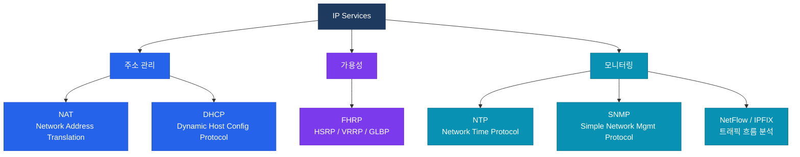

# IP 서비스 개요

## 정의

IP 서비스(IP Services)는 네트워크의 기본 데이터 전달 기능 위에서 **주소 관리, 가용성 보장, 모니터링** 등의 부가 기능을 제공하는 프로토콜 및 메커니즘의 집합이다.

## 특징

- **(주소 효율화)** NAT·DHCP로 IPv4 주소 고갈 문제를 완화하고 호스트에 동적으로 주소를 할당하여 관리 부담을 줄임
- **(가용성 보장)** FHRP(HSRP·VRRP·GLBP)로 기본 게이트웨이의 단일 장애점을 제거하여 엔드포인트 통신의 연속성을 확보
- **(운영 가시성)** NTP·SNMP·NetFlow로 네트워크 시간 동기화, 장비 상태 수집, 트래픽 흐름 분석을 일원화하여 운영 효율 극대화

## IP 서비스 분류

## 섹션 문서 링크

| 문서 | 핵심 프로토콜 | CCNP 시험 비중 |
|------|--------------|---------------|
| [NAT](./nat) | Static NAT · Dynamic NAT · PAT | 높음 |
| [DHCP](./dhcp) | DHCPv4 · Relay · DHCPv6 | 높음 |
| [FHRP](./fhrp) | HSRP · VRRP · GLBP | 높음 |
| [NTP](./ntp) | NTPv4 · Stratum · 인증 | 보통 |
| [SNMP & NetFlow](./snmp) | SNMPv3 · NetFlow v9 · IPFIX | 보통 |

## CCNP/CCIE 시험 비중

| 영역 | CCNP ENCOR 비중 | CCIE 비중 |
|------|----------------|----------|
| NAT / DHCP | 약 10% | 설정 + 트러블슈팅 |
| FHRP | 약 10% | 세부 타이머·우선순위 |
| NTP / SNMP | 약 5% | SNMPv3 보안 레벨 |

> CCNP ENCOR(350-401) 기준 IP Services 도메인은 전체 문제의 약 **15~20%** 를 차지한다.
