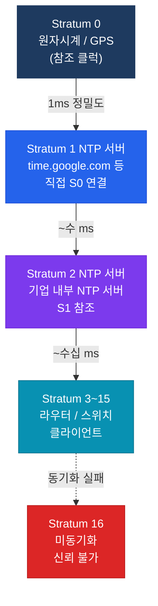

# NTP (Network Time Protocol)

## 정의

RFC 5905에 정의된 네트워크 시간 동기화 프로토콜로, 원자시계(Stratum 0)로부터 계층적 Stratum 구조를 통해 밀리초 단위의 정밀한 시간을 네트워크 장비에 분배하며 UDP 123 포트를 사용한다.

## 특징

- **(Stratum 계층 구조)** 원자시계(Stratum 0) → NTP 서버(Stratum 1) → 클라이언트(Stratum n) 계층으로 시간이 배포되며, Stratum 값이 낮을수록 정확도가 높음
- **(자동 최적 서버 선택)** 여러 NTP 서버 설정 시 알고리즘이 가장 정확한 서버(낮은 jitter·offset·dispersion)를 자동 선출하여 클럭 동기화
- **(인증으로 위변조 방지)** MD5/SHA 기반 NTP 인증으로 악의적인 NTP 서버 스푸핑 공격을 차단하여 보안 환경에서 신뢰할 수 있는 시간 동기화 보장

## 왜 필요한가?

라우터·스위치의 시간이 불일치하면 로그 분석, 인증서 유효성 검사, Kerberos 인증, 보안 감사(Syslog 타임스탬프)가 정상 동작하지 않는다. 특히 IPsec IKE 협상은 **피어 간 시간 차이가 5분 이상**이면 실패한다.

---

## NTP Stratum 구조



---

## NTP 모드 비교

| 모드 | 명령어 | 설명 |
|------|--------|------|
| Client | `ntp server [IP]` | 단방향 동기화 (서버에서 받음) |
| Peer | `ntp peer [IP]` | 양방향 동기화 (상호 동기) |
| Server | `ntp master [stratum]` | 로컬 클럭을 NTP 소스로 제공 |
| Broadcast Client | `ntp broadcast client` | 브로드캐스트 수신 (LAN) |

---

## 설정 및 검증

```bash
! NTP 서버 설정
R(config)# ntp server 216.239.35.0 prefer    ! Google NTP (prefer = 우선)
R(config)# ntp server 216.239.35.4

! 내부 NTP 마스터 (Stratum 3으로 배포)
R(config)# ntp master 3
R(config)# ntp update-calendar               ! 하드웨어 클럭 동기화

! NTP 인증
R(config)# ntp authenticate
R(config)# ntp authentication-key 1 md5 MyNTPSecret
R(config)# ntp trusted-key 1
R(config)# ntp server 10.1.1.1 key 1        ! 키와 함께 서버 참조

! 피어 설정 (Core 라우터 간 상호 동기)
R(config)# ntp peer 10.2.2.2

! 시간대 설정
R(config)# clock timezone KST 9              ! Korea Standard Time

! 검증
R# show ntp associations
R# show ntp status
R# show clock detail
R# show ntp associations detail
```

---

## CCNP/CCIE 시험 포인트

- **Stratum 16** = 동기화되지 않은 상태, 시간 신뢰 불가
- NTP는 **UDP 123** 포트 사용
- `ntp master [n]` 없이는 라우터가 NTP 서버 역할 불가
- NTP 인증: `ntp authenticate` → `authentication-key` → `trusted-key` 순서 필수
- **Stratum 범위**: 1~15 사용 가능 (0은 참조 클럭 전용)
- `prefer` 키워드: 동등 조건일 때 해당 서버 우선 선택
- IPsec IKE 협상 실패 원인 중 하나: **피어 간 시간 차이 > 300초(5분)**
