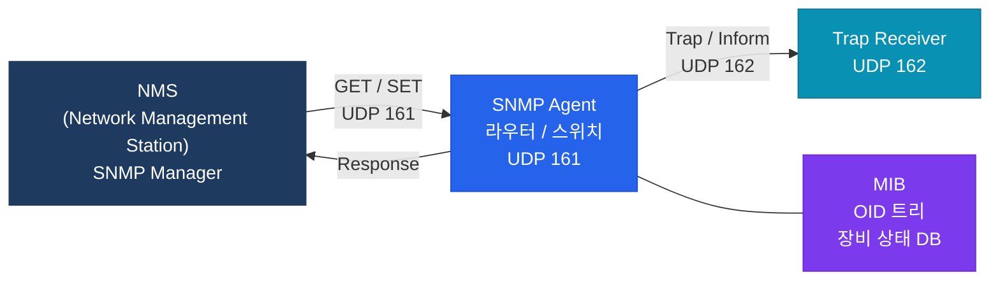

# SNMP & NetFlow

## 정의

**SNMP(Simple Network Management Protocol)** 는 네트워크 장비의 상태와 통계를 수집·관리하는 RFC 1157 기반 프로토콜이며, **NetFlow** 는 Cisco가 개발한 IP 트래픽 흐름(Flow) 데이터 수집 기술로 대역폭 분석과 보안 모니터링에 활용된다.

## 특징

- **(SNMP 계층 관리)** Manager가 Agent로부터 MIB(Management Information Base) OID를 폴링하거나 Trap/Inform으로 비동기 알림을 받아 장비 상태를 중앙 모니터링
- **(SNMPv3 보안 강화)** 사용자 기반 인증(MD5/SHA)과 암호화(DES/AES)를 제공하여 v1/v2c의 평문 Community String 취약점 해소
- **(NetFlow 트래픽 가시성)** 소스/목적지 IP, 포트, 프로토콜, 바이트, 패킷 수를 플로우 단위로 수집하여 대역폭 상위 사용자·애플리케이션 분석 및 이상 트래픽 탐지

---

## SNMP 아키텍처



---

## SNMPv1 vs v2c vs v3 비교

| 구분 | v1 | v2c | v3 |
|------|-----|------|-----|
| 인증 | Community String (평문) | Community String (평문) | 사용자 기반 (MD5/SHA) |
| 암호화 | 없음 | 없음 | DES / 3DES / AES |
| Inform | 없음 | 있음 (ACK) | 있음 (ACK) |
| Bulk Get | 없음 | 있음 | 있음 |
| 보안 수준 | 낮음 | 낮음 | 높음 |

---

## SNMPv3 보안 레벨

| 수준 | 인증 | 암호화 | 설명 |
|------|------|--------|------|
| noAuthNoPriv | 없음 | 없음 | 커뮤니티 문자열과 동일 수준 |
| authNoPriv | MD5/SHA | 없음 | 인증만 |
| authPriv | MD5/SHA | DES/AES | 인증 + 암호화 (권장) |

---

## 설정 및 검증

```bash
! === SNMPv2c 설정 ===
R(config)# snmp-server community PUBLIC ro        ! Read-Only
R(config)# snmp-server community PRIVATE rw       ! Read-Write (주의)
R(config)# snmp-server host 10.1.1.100 version 2c PUBLIC  ! Trap 대상

! Trap 이벤트 설정
R(config)# snmp-server enable traps bgp
R(config)# snmp-server enable traps ospf
R(config)# snmp-server enable traps interface

! === SNMPv3 설정 ===
R(config)# snmp-server group NMS-GROUP v3 priv   ! authPriv 그룹
R(config)# snmp-server user NMS-USER NMS-GROUP v3 auth sha Auth1234 priv aes 128 Priv1234
R(config)# snmp-server host 10.1.1.100 version 3 priv NMS-USER

! === NetFlow v9 설정 ===
R(config)# ip flow-export version 9
R(config)# ip flow-export destination 10.2.2.200 9995  ! Collector IP:Port
R(config)# ip flow-export source Loopback0

R(config)# interface GigabitEthernet0/0
R(config-if)#  ip flow ingress          ! 인바운드 플로우 수집
R(config-if)#  ip flow egress           ! 아웃바운드

! NetFlow 캐시 설정
R(config)# ip flow-cache timeout active 1      ! 1분마다 강제 export
R(config)# ip flow-cache timeout inactive 15   ! 15초 비활성 후 export

! 검증
R# show snmp
R# show snmp user
R# show snmp group
R# show ip cache flow           ! NetFlow 캐시
R# show ip flow interface       ! 인터페이스 수집 상태
```

---

## CCNP/CCIE 시험 포인트

- SNMP **GET/GETNEXT**: UDP 161, **Trap**: UDP 162
- **Trap vs Inform**: Trap은 응답 없음(UDP), Inform은 ACK 필요 (v2c/v3)
- SNMPv3 `authPriv` = 인증(SHA) + 암호화(AES) — 엔터프라이즈 권장
- Community String은 **평문 전송** — 스니핑 취약, v3 마이그레이션 권장
- NetFlow v5: 고정 필드, IPv4만 / v9: 템플릿 기반, IPv6·MPLS 지원 / IPFIX: 표준화된 v9
- `ip flow ingress` / `ip flow egress` 인터페이스별 별도 설정
- OID(Object Identifier): 점으로 구분된 숫자 트리 (예: 1.3.6.1.2.1.1.3 = sysUpTime)
