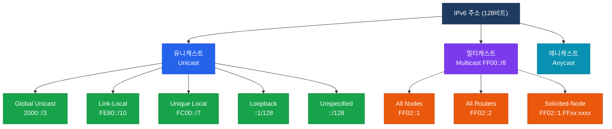

# IPv6 개요
**IPv6 Overview**

## 정의

RFC 2460에서 정의된 차세대 인터넷 프로토콜로, 128비트 주소 공간을 통해 IPv4의 주소 고갈 문제를 해결하고 자동 구성·보안·QoS를 기본 사양으로 포함한 네트워크 계층 프로토콜.

## 특징

- **(128비트 주소 공간)** 약 3.4×10³⁸개의 주소를 제공하여 IoT·모바일·인프라 확장에 충분한 주소 자원 확보
- **(헤더 단순화)** 고정 40바이트 기본 헤더와 확장 헤더 체계로 라우터의 처리 부담을 줄이고 포워딩 성능 향상
- **(내장 자동 구성)** SLAAC(Stateless Address Autoconfiguration)과 NDP를 통해 DHCP 없이도 주소를 자동으로 생성·관리

## IPv4 vs IPv6 비교

| 구분 | IPv4 | IPv6 |
|------|------|------|
| 주소 길이 | 32비트 | 128비트 |
| 주소 표기 | 점-십진수 (192.168.1.1) | 콜론-16진수 (2001:db8::1) |
| 주소 공간 | 약 43억 개 | 약 3.4×10³⁸개 |
| 헤더 크기 | 가변 (20~60바이트) | 고정 40바이트 |
| 브로드캐스트 | 지원 | 없음 (멀티캐스트로 대체) |
| ARP | 사용 (ARP/RARP) | 없음 (NDP로 대체) |
| IP 단편화 | 라우터·호스트 모두 가능 | 호스트만 가능 |
| IPsec | 선택적 | 설계에 포함 (필수 지원) |
| QoS | ToS 필드 | Traffic Class + Flow Label |
| 체크섬 | 헤더 포함 | 헤더에서 제거 |
| 주소 자동 구성 | DHCP 의존 | SLAAC + DHCPv6 |
| NAT | 일반적으로 사용 | 불필요 (End-to-End 지향) |

## IPv6 주소 체계

## 섹션 문서 링크

| 문서 | 주요 내용 |
|------|-----------|
| [IPv6 기본](./ipv6-basics) | 주소 유형, EUI-64, NDP, ICMPv6, SLAAC |
| [IPv6 라우팅](./ipv6-routing) | OSPFv3, EIGRPv6, MP-BGP, RIPng |
| [IPv6 전환 기술](./ipv6-transition) | Dual Stack, 터널링, NAT64/DNS64 |

## CCNP/CCIE 시험 비중

| 시험 | 비중 | 주요 출제 영역 |
|------|------|----------------|
| ENCOR (350-401) | 약 10~15% | 주소 유형, NDP, OSPFv3, 전환 기술 |
| ENARSI (300-410) | 약 15~20% | OSPFv3, EIGRPv6, MP-BGP, 정책 라우팅 |
| CCIE Enterprise | 높음 | 전 영역 심층 설정 및 트러블슈팅 |
