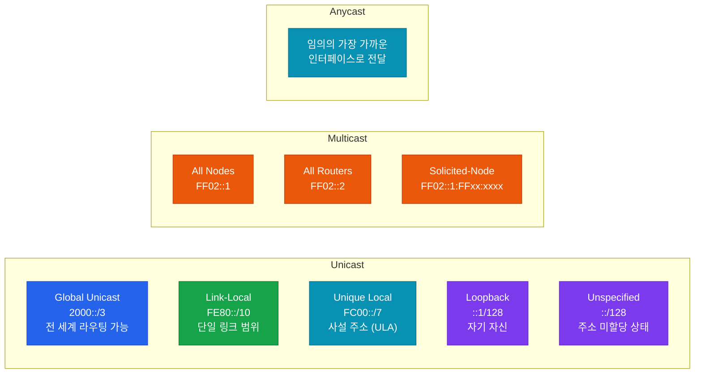
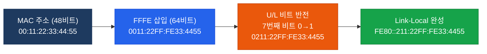
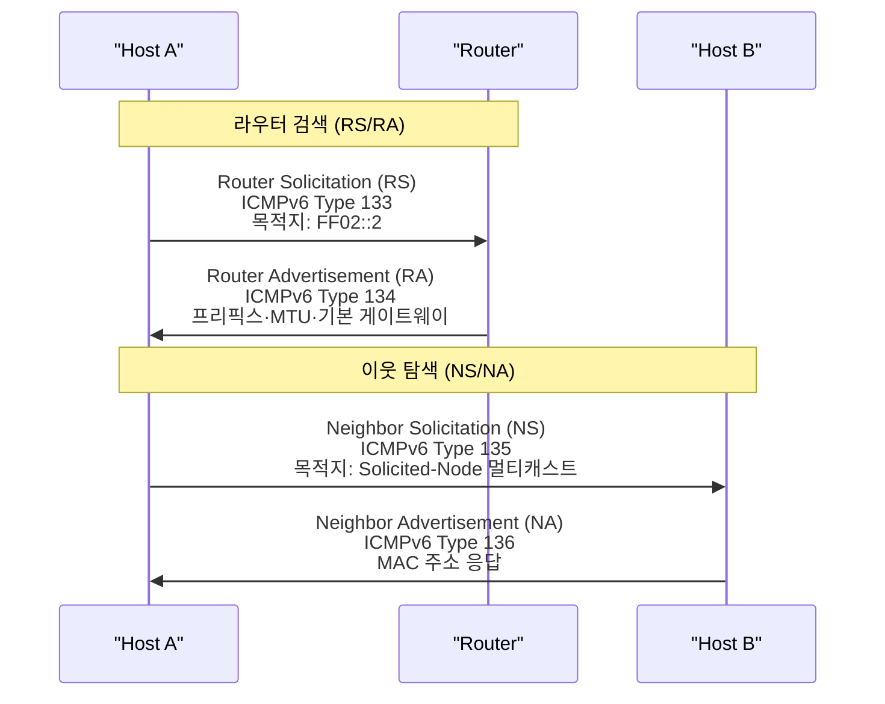

# IPv6 기본
**IPv6 Addressing & Types**

## 정의

IPv6 기본 주소 체계는 128비트 주소를 유니캐스트·멀티캐스트·애니캐스트로 분류하고, EUI-64 인터페이스 ID 생성과 NDP(Neighbor Discovery Protocol)를 통해 ARP 없이 자동으로 주소를 구성·관리하는 메커니즘.

## 특징

- **(계층적 주소 구조)** 64비트 네트워크 프리픽스와 64비트 인터페이스 ID로 구성되어 라우팅 집약과 자동 구성을 동시에 지원
- **(NDP 기반 이웃 관리)** ICMPv6를 활용하는 NDP가 ARP·RARP·ICMP 라우터 검색을 모두 대체하여 브로드캐스트 없이 이웃 탐색 수행
- **(SLAAC 자동 구성)** 라우터 광고(RA)의 프리픽스 정보와 EUI-64 인터페이스 ID를 결합해 DHCPv6 없이도 글로벌 주소를 자동 생성

## IPv6 주소 유형



| 유형 | 프리픽스 | 범위 | 설명 |
|------|----------|------|------|
| Global Unicast | 2000::/3 | 전 세계 | 공인 IPv6 주소, ISP 할당 |
| Link-Local | FE80::/10 | 단일 링크 | 인터페이스 활성화 시 자동 생성, 필수 |
| Unique Local | FC00::/7 | 사이트 내부 | IPv4 사설 주소 역할 (RFC 4193) |
| Multicast | FF00::/8 | 그룹 범위 | 브로드캐스트 대체, 그룹 통신 |
| Loopback | ::1/128 | 호스트 | IPv4의 127.0.0.1 역할 |
| Unspecified | ::/128 | 호스트 | 주소 미결정 상태에서 소스로 사용 |
| Anycast | 유니캐스트 공간 | 토폴로지 의존 | 가장 가까운 인터페이스로 라우팅 |

## 주소 표기 규칙

IPv6 주소는 128비트를 16비트씩 8개 그룹으로 나누어 콜론으로 구분한다.

```
전체 표기:  2001:0DB8:0000:0000:0000:0000:0000:0001
규칙 1 (선행 0 생략):  2001:DB8:0:0:0:0:0:1
규칙 2 (연속 0 그룹 :: 축약):  2001:DB8::1
주의: :: 는 주소 전체에서 한 번만 사용 가능
```

| 원본 | 축약 표기 |
|------|-----------|
| FE80:0000:0000:0000:0211:22FF:FE33:4455 | FE80::211:22FF:FE33:4455 |
| 0000:0000:0000:0000:0000:0000:0000:0001 | ::1 |
| 2001:0DB8:0000:0001:0000:0000:0000:0001 | 2001:DB8:0:1::1 |

## EUI-64 인터페이스 ID 형성

EUI-64는 48비트 MAC 주소로부터 64비트 인터페이스 ID를 생성하는 방법이다.



1. MAC 주소 중간(24비트/24비트 경계)에 `FF:FE` 삽입 → 64비트
2. 첫 바이트의 7번째 비트(U/L 비트) 반전 (0→1: 전역 고유, 1→0: 로컬)
3. 결과 64비트가 인터페이스 ID로 사용

## NDP (Neighbor Discovery Protocol)

NDP는 ICMPv6(Type 133~137)를 기반으로 동작하며 IPv4의 ARP·RARP·ICMP 라우터 검색을 모두 대체한다.



| ICMPv6 타입 | 메시지 | 역할 |
|-------------|--------|------|
| 133 | Router Solicitation (RS) | 호스트 → 라우터 요청 |
| 134 | Router Advertisement (RA) | 라우터 → 호스트 광고 (프리픽스·MTU) |
| 135 | Neighbor Solicitation (NS) | ARP Request 역할 |
| 136 | Neighbor Advertisement (NA) | ARP Reply 역할 |
| 137 | Redirect | 더 나은 첫 번째 홉 안내 |

## ICMPv6 메시지 유형

| 유형 | 타입 번호 | 설명 |
|------|-----------|------|
| Echo Request | 128 | Ping 요청 |
| Echo Reply | 129 | Ping 응답 |
| Destination Unreachable | 1 | 목적지 도달 불가 |
| Packet Too Big | 2 | MTU 초과 (PMTUD) |
| Time Exceeded | 3 | TTL(Hop Limit) 초과 |
| Parameter Problem | 4 | 헤더 파라미터 오류 |
| MLD Query/Report | 130/131 | 멀티캐스트 그룹 관리 |

## 설정 및 검증

```bash
! IPv6 유니캐스트 라우팅 활성화 (라우터 필수)
R(config)# ipv6 unicast-routing

! 인터페이스에 IPv6 주소 수동 할당
R(config)# interface GigabitEthernet0/0
R(config-if)# ipv6 address 2001:DB8:1::1/64
R(config-if)# no shutdown

! EUI-64 자동 인터페이스 ID 생성
R(config-if)# ipv6 address 2001:DB8:1::/64 eui-64

! SLAAC로 주소 자동 구성 (호스트/CE)
R(config-if)# ipv6 address autoconfig

! Link-Local 주소 수동 지정
R(config-if)# ipv6 address FE80::1 link-local

! 검증 명령어
R# show ipv6 interface brief
R# show ipv6 interface GigabitEthernet0/0
R# show ipv6 neighbors
R# show ipv6 neighbors GigabitEthernet0/0
R# ping ipv6 2001:DB8:1::2
R# ping FE80::2 GigabitEthernet0/0
```

## CCNP/CCIE 시험 포인트

- **Link-Local 주소는 필수**: `ipv6 enable` 또는 주소 할당 시 FE80::/10 주소가 자동 생성되며, 라우팅 프로토콜의 Next-Hop은 Link-Local 주소를 사용
- **NDP는 ICMPv6 기반**: ARP가 아닌 ICMPv6 Type 135(NS)/136(NA)로 MAC 주소 확인, `show ipv6 neighbors`로 확인
- **ARP 테이블 없음**: IPv6 환경에서는 `show arp`가 아닌 `show ipv6 neighbors`로 이웃 테이블 확인
- **EUI-64 U/L 비트**: MAC 주소 첫 바이트 7번째 비트를 반전(0→1)하므로 `00`으로 시작하는 MAC은 EUI-64 후 `02`로 변환됨
- **SLAAC와 DHCPv6 공존**: RA의 M 플래그(Managed)=1이면 DHCPv6, O 플래그(Other)=1이면 상태 비저장 DHCPv6로 추가 정보 획득
- **Solicited-Node 멀티캐스트**: `FF02::1:FF` + 유니캐스트 주소의 하위 24비트, NS 메시지의 목적지로 사용
- **::1은 Loopback**: IPv4의 127.0.0.1에 해당, 인터페이스에 할당되지 않으며 호스트 자신을 가리킴
