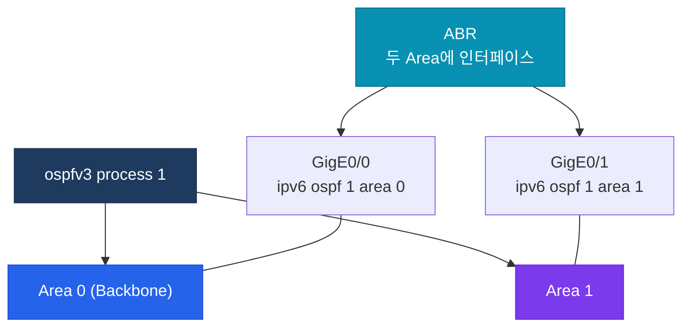

# IPv6 라우팅

## 정의

IPv6 주소 체계를 기반으로 라우터 간 경로 정보를 교환하고 최적 경로를 선택하는 라우팅 프로토콜 군으로, OSPFv3·EIGRPv6(Named)·BGP4+(MP-BGP)·RIPng가 IPv6 환경을 지원한다.

## 특징

- **(링크-로컬 주소 활용)** 모든 IPv6 라우팅 프로토콜은 인터페이스의 Link-local 주소(FE80::/10)를 넥스트홉과 Hello 패킷 소스로 사용하여 글로벌 주소 없이도 인접 관계 형성 가능
- **(멀티캐스트 기반 제어)** ARP 없이 ICMPv6·NDP 멀티캐스트로 네이버를 발견하며, 라우팅 프로토콜도 FF02::/16 링크-로컬 멀티캐스트로 제어 메시지 전송
- **(프로세스 단위 활성화)** `ipv6 unicast-routing`을 전역 활성화한 후 각 프로토콜을 인터페이스 또는 프로세스 레벨에서 설정하는 방식으로 IPv4 라우팅과 독립적 운용

---

## IPv6 라우팅 프로토콜 비교

| 프로토콜 | 유형 | 멀티캐스트 주소 | 관리 거리 | 설정 방식 |
|---------|------|---------------|---------|---------|
| OSPFv3 | 링크 상태 | FF02::5, FF02::6 | 110 | 인터페이스 모드 |
| EIGRPv6 | 거리 벡터(DUAL) | FF02::A | 90/170 | Named 모드 권장 |
| BGP4+ (MP-BGP) | 경로 벡터 | 유니캐스트 (TCP 179) | 20/200 | address-family ipv6 |
| RIPng | 거리 벡터 | FF02::9 | 120 | 인터페이스 모드 |
| Static | - | - | 1 | `ipv6 route` |

---

## OSPFv3 구조



---

## 설정 및 검증

```bash
! 필수 전제 조건
R(config)# ipv6 unicast-routing

! === OSPFv3 설정 ===
R(config)# router ospfv3 1
R(config-router)#  router-id 1.1.1.1               ! Router-ID 필수 (IPv4 형식)

R(config)# interface GigabitEthernet0/0
R(config-if)#  ipv6 ospf 1 area 0                  ! 인터페이스에서 직접 설정

! OSPFv3 Address-Family 방식 (IOS-XE)
R(config)# router ospfv3 1
R(config-router)#  address-family ipv6 unicast
R(config-router-af)#   area 0 range 2001:db8::/32   ! 요약

! === EIGRPv6 Named 설정 ===
R(config)# router eigrp CORP
R(config-router)#  address-family ipv6 unicast autonomous-system 100
R(config-router-af)#   eigrp router-id 2.2.2.2
R(config-router-af)#   network ::/0                 ! 모든 IPv6 인터페이스

! === MP-BGP IPv6 설정 ===
R(config)# router bgp 65001
R(config-router)#  neighbor 2001:db8::2 remote-as 65002
R(config-router)#  address-family ipv6
R(config-router-af)#   neighbor 2001:db8::2 activate
R(config-router-af)#   network 2001:db8:1::/48

! === RIPng 설정 ===
R(config)# ipv6 router rip RIPNG-PROC
R(config)# interface GigabitEthernet0/0
R(config-if)#  ipv6 rip RIPNG-PROC enable

! === IPv6 Static Route ===
R(config)# ipv6 route 2001:db8:2::/48 2001:db8::2   ! 넥스트홉
R(config)# ipv6 route ::/0 GigabitEthernet0/0 FE80::1  ! 기본 경로 + LL 넥스트홉

! 검증
R# show ipv6 route
R# show ipv6 ospf neighbor
R# show ipv6 eigrp neighbors
R# show bgp ipv6 unicast summary
R# show ipv6 rip database
```

---

## CCNP/CCIE 시험 포인트

- OSPFv3는 **Router-ID 수동 설정 필수** — IPv4 인터페이스 없으면 자동 선출 불가
- OSPFv3 Hello 패킷 소스: **Link-local 주소** (FE80::)
- `ipv6 unicast-routing` 없으면 IPv6 포워딩 비활성 — 설정 첫 단계
- EIGRPv6 Named: `address-family ipv6 unicast autonomous-system [n]` 구조
- BGP4+: `address-family ipv6` + `neighbor activate` 필수 — IPv4 BGP와 독립 활성화
- RIPng 멀티캐스트: **FF02::9** (IPv4 RIP 224.0.0.9와 유사)
- IPv6 Static에서 인터페이스와 Link-local 넥스트홉 함께 지정: `ipv6 route [prefix] [if] [LL-nexthop]`
