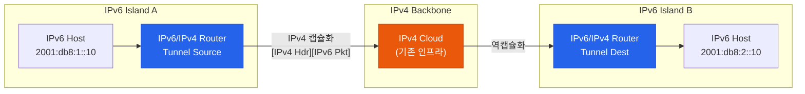
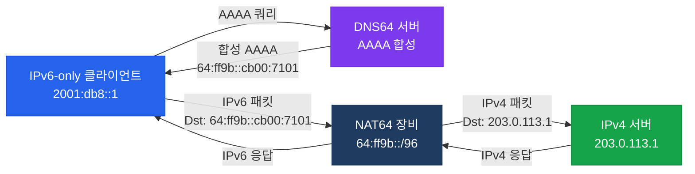

# IPv6 전환 기술

## 정의

IPv4에서 IPv6로 점진적으로 이전하는 과정에서 두 프로토콜이 공존하거나 상호 통신할 수 있도록 하는 기술 집합으로, Dual Stack·터널링·변환(Translation) 세 가지 범주로 구분된다.

## 특징

- **(Dual Stack 이상적 공존)** 단일 장비가 IPv4와 IPv6를 동시에 운용하여 양쪽 주소 체계의 호스트와 모두 통신할 수 있으며, 전환 기간 동안 가장 이상적이고 안정적인 방식
- **(터널링 — 기존 인프라 재사용)** IPv4 인프라 위에 IPv6 패킷을 캡슐화하여 전송함으로써 IPv6 라우팅 인프라 없이도 IPv6 아일랜드 간 통신 가능
- **(NAT64/DNS64 — 프로토콜 변환)** IPv6 전용 클라이언트가 IPv4 서버에 접속할 수 있도록 주소와 프로토콜을 변환하여 IPv6 전용 환경에서도 레거시 인프라 접근 보장

---

## 전환 기술 비교

| 기술 | 방식 | 장점 | 단점 |
|------|------|------|------|
| Dual Stack | 동시 운용 | 완전한 상호 운용 | IPv4 주소 소진 문제 지속 |
| 6in4 (Manual) | IPv4로 IPv6 캡슐화 | 단순, 예측 가능 | 수동 설정, 확장성 낮음 |
| 6to4 | 2002::/16 자동 매핑 | 자동화 | 릴레이 라우터 의존 |
| ISATAP | 인트라넷 IPv4 위 IPv6 | 자동 주소 구성 | 멀티캐스트 미지원 |
| 6RD | ISP 배포용 6in4 | 빠른 ISP 배포 | ISP 의존 |
| NAT64 + DNS64 | IPv6 → IPv4 변환 | IPv6-only 호스트 지원 | 상태 유지 필요 |

---

## 터널링 방식 동작



---

## NAT64 + DNS64 동작



---

## 설정 및 검증

```bash
! === Dual Stack ===
R(config)# ipv6 unicast-routing
R(config)# interface GigabitEthernet0/0
R(config-if)#  ip address 192.168.1.1 255.255.255.0
R(config-if)#  ipv6 address 2001:db8:1::1/64

! === 6in4 수동 터널 ===
R(config)# interface Tunnel0
R(config-if)#  tunnel source 203.0.113.1         ! 로컬 IPv4
R(config-if)#  tunnel destination 198.51.100.1   ! 원격 IPv4
R(config-if)#  tunnel mode ipv6ip                ! 6in4 모드
R(config-if)#  ipv6 address 2001:db8:ff::1/64

! === 6to4 자동 터널 ===
R(config)# interface Tunnel0
R(config-if)#  tunnel source 203.0.113.1         ! IPv4 주소
R(config-if)#  tunnel mode ipv6ip 6to4
R(config-if)#  ipv6 address 2002:cb00:7101::1/16  ! 2002:[IPv4]/48

! === ISATAP 터널 ===
R(config)# interface Tunnel0
R(config-if)#  tunnel source GigabitEthernet0/0
R(config-if)#  tunnel mode ipv6ip isatap
R(config-if)#  ipv6 address 2001:db8::/32 eui-64

! 검증
R# show interfaces Tunnel0
R# show ipv6 route
R# show ipv6 interface brief
```

---

## CCNP/CCIE 시험 포인트

- **6to4 프리픽스**: 2002::[IPv4 hex]/48 — IPv4 주소가 자동으로 인코딩
- **6to4 릴레이 라우터**: 순수 IPv6 네트워크로의 전달 담당 (Anycast 192.88.99.1)
- **NAT64 Well-known 프리픽스**: `64:ff9b::/96` — 뒤 32비트가 IPv4 주소
- **DNS64**: AAAA 레코드 없는 서버에 NAT64 주소를 합성 — NAT64와 반드시 쌍으로 사용
- ISATAP: `::0:5efe:[IPv4]` 형식의 인터페이스 ID로 자동 주소 구성
- **6RD**: ISP가 6in4를 자동화 — `ipv6 rd` 파라미터로 프리픽스 계산
- Dual Stack은 **IPv4 주소를 계속 소비** — 장기 전환 전략이 아닌 과도기용
