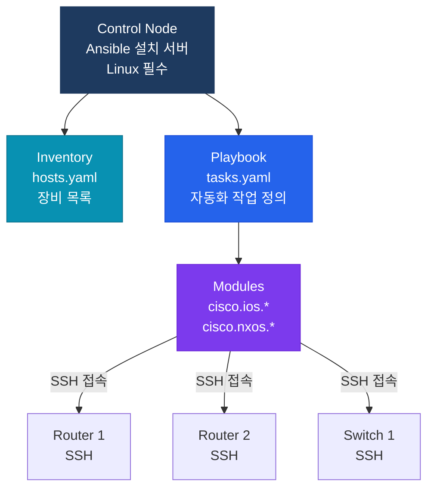

# Ansible 네트워크 자동화

## 정의

Red Hat이 개발한 에이전트리스(Agentless) 오픈소스 자동화 플랫폼으로, YAML 기반 Playbook으로 Cisco 네트워크 장비에 SSH/NETCONF를 통해 설정을 배포하고 상태를 검증하는 **멱등성(Idempotent)** 자동화 도구다.

## 특징

- **(에이전트 불필요)** 대상 장비에 별도 에이전트 설치 없이 SSH만으로 접속하므로 기존 네트워크 인프라에 즉시 적용 가능하며, 관리 오버헤드 최소화
- **(멱등성 보장)** 동일 Playbook을 반복 실행해도 항상 동일한 최종 상태를 보장하여, 장비 현재 상태와 원하는 상태를 비교 후 필요한 변경만 적용
- **(cisco.ios 컬렉션)** Ansible Galaxy의 `cisco.ios` 컬렉션이 IOS/IOS-XE의 라우팅·인터페이스·VLAN·BGP 등 수십 개의 모듈을 제공하여 CLI 파싱 없이 구조화된 설정 자동화

---

## Ansible 아키텍처



---

## Inventory 파일 (YAML)

```yaml
# hosts.yaml
all:
  children:
    routers:
      hosts:
        R1:
          ansible_host: 192.168.1.1
        R2:
          ansible_host: 192.168.1.2
      vars:
        ansible_network_os: cisco.ios.ios
        ansible_connection: network_cli
        ansible_user: admin
        ansible_password: Cisco123!
        ansible_become: yes
        ansible_become_method: enable
        ansible_become_password: Enable123!
    switches:
      hosts:
        SW1:
          ansible_host: 192.168.1.10
```

---

## Playbook 예시

```yaml
# ospf_config.yaml
---
- name: OSPF 설정 자동화
  hosts: routers
  gather_facts: no

  tasks:
    - name: OSPF 프로세스 설정
      cisco.ios.ios_ospfv2:
        config:
          processes:
            - process_id: 1
              router_id: "{{ inventory_hostname }}.1.1.1"
              network:
                - address: 10.0.0.0
                  wildcard_bits: 0.0.0.255
                  area: 0
              passive_interfaces:
                default: no
                interface:
                  - name: Loopback0
                    set_interface: yes
        state: merged          # merged: 기존 설정 유지 + 추가

    - name: 인터페이스 설명 설정
      cisco.ios.ios_interfaces:
        config:
          - name: GigabitEthernet0/0
            description: "WAN-Uplink"
            enabled: true
        state: merged

    - name: 설정 저장
      cisco.ios.ios_command:
        commands:
          - write memory

    - name: OSPF 네이버 확인
      cisco.ios.ios_command:
        commands:
          - show ip ospf neighbor
      register: ospf_output

    - name: OSPF 결과 출력
      debug:
        msg: "{{ ospf_output.stdout_lines }}"
```

---

## 주요 cisco.ios 모듈

| 모듈 | 기능 |
|------|------|
| `ios_command` | show 명령어 실행 |
| `ios_config` | 원시 CLI 설정 (raw) |
| `ios_interfaces` | 인터페이스 설정 |
| `ios_vlans` | VLAN 설정 |
| `ios_bgp_global` | BGP 전역 설정 |
| `ios_ospfv2` | OSPFv2 설정 |
| `ios_acls` | ACL 설정 |
| `ios_facts` | 장비 정보 수집 |

---

## CCNP/CCIE 시험 포인트

- Ansible은 **에이전트리스** — SSH 외 추가 소프트웨어 불필요
- **멱등성**: 동일 Playbook 반복 실행 = 동일 결과 (현재 상태 비교 후 필요 변경만)
- `state: merged` (추가) vs `state: replaced` (덮어쓰기) vs `state: deleted` (삭제)
- `gather_facts: no` — 네트워크 장비는 팩트 수집 비활성화 권장 (시간 단축)
- Ansible Control Node는 **Linux 필수** — Windows는 WSL 필요
- `ios_config` (원시 CLI) vs `ios_ospfv2` (구조화 모듈) — 시험에서 모듈 방식 권장
- **Jinja2 템플릿**: `{{ variable }}` 변수 치환으로 동적 설정 생성
