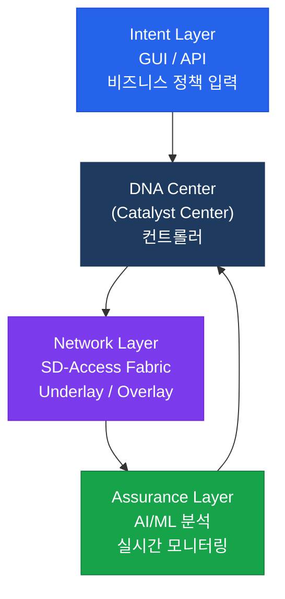
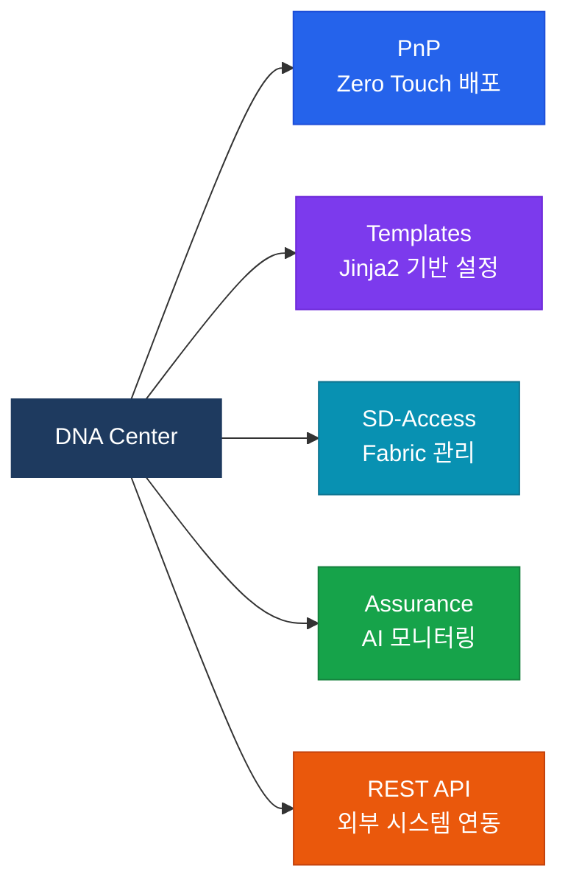

# Cisco DNA Center (Cisco Catalyst Center)

## 정의

Cisco의 엔터프라이즈 네트워크 자동화 플랫폼으로, **IBN(Intent-Based Networking)** 을 구현하여 비즈니스 의도(Intent)를 네트워크 정책으로 자동 변환하고 실시간 Assurance로 SLA 준수 여부를 검증하는 중앙 컨트롤러다(구 DNA Center, 현 Cisco Catalyst Center).

## 특징

- **(의도 기반 네트워킹)** GUI 또는 API로 "영업팀은 재무팀 서버에 접근 불가" 같은 비즈니스 의도를 입력하면 SGT·VLAN·ACL로 자동 변환하여 배포
- **(실시간 Network Assurance)** AI/ML 기반 분석으로 장비 상태·트래픽·클라이언트 경험을 연속 모니터링하고 이상을 자동 감지하여 MTTR 단축
- **(Zero Touch Provisioning)** PnP(Plug and Play)로 신규 장비를 물리적으로 연결만 하면 DNA Center가 자동으로 설정을 배포하여 온사이트 엔지니어 없이 지사 배포 가능

---

## DNA Center 아키텍처



---

## IBN 4단계 사이클

| 단계 | 설명 | DNA Center 기능 |
|------|------|----------------|
| Intent (의도) | 비즈니스 정책 정의 | GUI/API로 정책 입력 |
| Instantiate (구현) | 정책 → 네트워크 설정 변환 | 자동 템플릿 생성·배포 |
| Activate (활성화) | 장비에 설정 적용 | Provisioning (PnP/NETCONF) |
| Assure (검증) | SLA 준수 여부 지속 확인 | Network Assurance |

---

## 주요 기능



---

## DNA Center API 사용

```python
import requests

BASE = "https://dnac.example.com"
AUTH_URL = f"{BASE}/dna/system/api/v1/auth/token"

# 토큰 획득
resp = requests.post(AUTH_URL, auth=("admin", "Cisco123!"), verify=False)
token = resp.json()["Token"]

headers = {
    "X-Auth-Token": token,
    "Content-Type": "application/json"
}

# 네트워크 장비 목록
devices = requests.get(f"{BASE}/dna/intent/api/v1/network-device",
                       headers=headers, verify=False)
for dev in devices.json()["response"]:
    print(f"{dev['hostname']}: {dev['managementIpAddress']}")

# 장비 설정 배포
payload = {
    "templateId": "your-template-id",
    "targetInfo": [{"id": "device-uuid", "type": "MANAGED_DEVICE_UUID"}]
}
requests.post(f"{BASE}/dna/intent/api/v1/template-programmer/template/deploy",
              headers=headers, json=payload, verify=False)
```

---

## CCNP/CCIE 시험 포인트

- DNA Center는 **SD-Access의 컨트롤러** — ISE가 정책 서버, DNA Center가 오케스트레이터
- **IBN 4단계**: Intent → Instantiate → Activate → Assure
- PnP(Plug and Play): 신규 장비 자동 배포 — DHCP Option 43 또는 DNS로 DNA Center 검색
- **DNA Center API**: `X-Auth-Token` 헤더로 JWT 토큰 인증
- SD-Access와 SD-WAN은 별개 솔루션: SD-Access = LAN, SD-WAN = WAN
- DNA Center Assurance: **Client 360, Device 360** 대시보드로 상세 분석
- Cisco Catalyst Center = DNA Center 리브랜딩 (2023년~), 동일 제품
