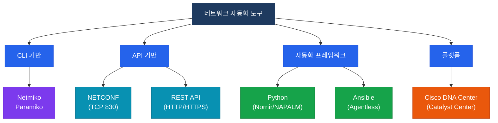

# 네트워크 자동화 개요
**Network Automation Overview**

## 정의

스크립트·API·자동화 플랫폼을 이용해 네트워크 장비의 설정·모니터링·프로비저닝을 사람의 직접 개입 없이 프로그래밍 방식으로 수행하는 기술 패러다임.

## 특징

- **(반복 작업 제거)** 동일한 설정 작업을 스크립트로 자동 실행하여 인적 오류를 줄이고 운영 효율을 높임
- **(일관성 보장)** 모든 장비에 동일한 템플릿과 정책을 적용하여 설정 드리프트(Configuration Drift) 방지
- **(신속한 변경 배포)** 수백 대 장비에 대한 변경을 분 단위로 동시 적용하여 서비스 배포 속도 극대화

## 왜 필요한가?

전통적 CLI 기반 수동 운영은 대규모 네트워크에서 한계에 봉착한다.

```
수동 운영의 문제점
├── 인적 오류 (Human Error): 설정 오타·누락
├── 확장성 부재: 장비 100대 → 100번 반복 SSH
├── 변경 속도: 티켓 → 승인 → 수작업 → 수 시간
└── 설정 드리프트: 장비마다 조금씩 다른 설정
```

네트워크 자동화는 이 문제를 코드(Infrastructure as Code)로 해결한다.

## 자동화 도구 분류



## 전통 네트워킹 vs 자동화 비교

| 구분 | 전통 네트워킹 | 네트워크 자동화 |
|------|--------------|----------------|
| 설정 방법 | CLI 수작업 (Telnet/SSH) | 스크립트·API·플랫폼 |
| 변경 속도 | 시간~일 단위 | 분 단위 |
| 확장성 | 장비 수에 비례 | 장비 수 무관 |
| 오류 가능성 | 높음 (인적 오류) | 낮음 (코드 검증) |
| 설정 일관성 | 드리프트 발생 | 템플릿 기반 동일 |
| 검증 방법 | 수동 `show` 확인 | 자동 테스트·Assurance |
| 필요 기술 | CLI 숙련도 | 프로그래밍 + 네트워크 |

## 섹션 문서 링크

| 문서 | 주요 도구/기술 | 시험 비중 |
|------|--------------|----------|
| [Python 네트워크 자동화](./python) | Netmiko, NAPALM, Nornir | 높음 |
| [Ansible](./ansible) | Playbook, cisco.ios 컬렉션 | 높음 |
| [NETCONF & YANG](./netconf-yang) | RFC 6241, ncclient | 중간 |
| [REST API](./rest-api) | RESTCONF, requests | 높음 |
| [Cisco DNA Center](./dna-center) | IBN, SD-Access, API | 중간 |

## CCNP/CCIE 시험 비중

CCNP ENCOR 시험(350-401) 기준 **네트워크 자동화** 도메인은 전체의 **15%** 를 차지한다.

| 주요 출제 영역 | 세부 내용 |
|--------------|---------|
| Python 기초 | Netmiko, JSON/YAML 파싱 |
| Ansible | Playbook 구조, 멱등성, 모듈 |
| NETCONF/RESTCONF | 포트 번호, 데이터스토어, 차이점 |
| REST API | HTTP 메소드, 상태 코드, CRUD |
| DNA Center | IBN, SD-Access, API 활용 |
| 데이터 포맷 | JSON vs XML vs YAML 비교 |

:::tip 시험 전략
자동화 섹션은 **개념 이해 + 코드 읽기** 능력을 동시에 평가한다. Python 코드를 직접 작성하지 않아도 되지만, 주어진 코드가 무엇을 하는지 이해해야 한다.
:::
