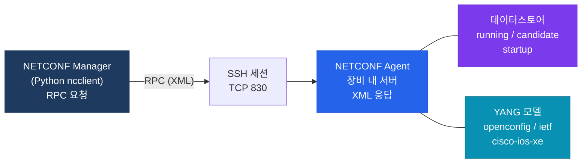

# NETCONF & YANG

## 정의

**NETCONF(RFC 6241)** 는 네트워크 장비의 설정을 XML로 구조화하여 SSH(TCP 830)로 원격 관리하는 프로토콜이며, **YANG(RFC 6020/7950)** 은 NETCONF가 교환하는 데이터의 구조와 타입을 정의하는 데이터 모델링 언어다.

## 특징

- **(구조화 설정 관리)** XML 기반으로 설정을 계층 구조로 표현하여 CLI 파싱 없이 정확한 설정 읽기/쓰기가 가능하고, 부분 설정 Lock으로 동시 변경 충돌 방지
- **(데이터스토어 분리)** running(활성 설정), startup(재시작 후 설정), candidate(임시 설정) 데이터스토어를 구분하여 설정 검증 후 원자적 커밋 가능
- **(YANG 표준 모델)** OpenConfig·IETF 표준 YANG 모델을 통해 벤더 간 동일한 데이터 구조로 설정을 교환하여 멀티벤더 자동화의 이식성 향상

---

## NETCONF 아키텍처



---

## NETCONF Operations

| Operation | 기능 |
|-----------|------|
| `<get>` | 운영 데이터 + 설정 데이터 조회 |
| `<get-config>` | 특정 데이터스토어 설정 조회 |
| `<edit-config>` | 설정 변경 (merge/replace/delete) |
| `<copy-config>` | 데이터스토어 복사 |
| `<delete-config>` | 데이터스토어 삭제 |
| `<lock>` / `<unlock>` | 데이터스토어 잠금 |
| `<commit>` | candidate → running 적용 |
| `<close-session>` | 세션 종료 |

---

## NETCONF vs RESTCONF 비교

| 구분 | NETCONF | RESTCONF |
|------|---------|---------|
| 전송 | SSH (TCP 830) | HTTP/HTTPS |
| 인코딩 | XML | JSON / XML |
| 표준 | RFC 6241 | RFC 8040 |
| 데이터스토어 | running/candidate/startup | running만 |
| 트랜잭션 | lock + commit (원자적) | 없음 |
| 주요 용도 | 엔터프라이즈 설정 관리 | REST API 연동 |

---

## 설정 및 검증 (Python ncclient)

```python
from ncclient import manager
import xml.etree.ElementTree as ET

# NETCONF 접속
with manager.connect(
    host='192.168.1.1',
    port=830,
    username='admin',
    password='Cisco123!',
    hostkey_verify=False,
    device_params={'name': 'iosxe'}
) as m:
    # 설정 조회 (get-config)
    config = m.get_config(source='running')
    print(config.xml)

    # 인터페이스 설정 (edit-config)
    config_payload = """
    <config>
      <interfaces xmlns="urn:ietf:params:xml:ns:yang:ietf-interfaces">
        <interface>
          <name>GigabitEthernet1</name>
          <description>NETCONF-Managed</description>
          <enabled>true</enabled>
        </interface>
      </interfaces>
    </config>
    """
    m.edit_config(target='running', config=config_payload)
```

```bash
! 장비에서 NETCONF 활성화 (IOS-XE)
R(config)# netconf-yang
R(config)# netconf-yang feature candidate-datastore  ! candidate 지원

! 검증
R# show netconf-yang sessions
R# show netconf-yang statistics
```

---

## CCNP/CCIE 시험 포인트

- NETCONF 포트: **TCP 830** (SSH 22와 별도)
- `netconf-yang` 명령어로 장비에서 NETCONF 활성화 필수
- **candidate 데이터스토어**: 설정 검증 후 commit — `edit-config target='candidate'` → `commit`
- YANG 모델 종류: ietf(표준) / openconfig(멀티벤더) / cisco-ios-xe(벤더 고유)
- RESTCONF는 **트랜잭션 없음** — 원자적 설정이 필요하면 NETCONF 사용
- `<lock>` 없이 동시 설정 변경 시 충돌 가능 — 엔터프라이즈는 Lock 필수
- ncclient Python 라이브러리: `manager.connect()` → `get_config()` / `edit_config()`
