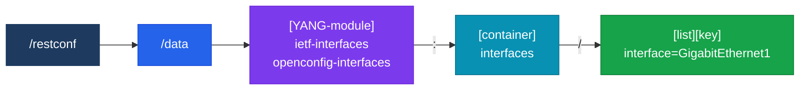

# REST API & RESTCONF

## 정의

**REST(Representational State Transfer)** 는 HTTP 메소드(GET/POST/PUT/PATCH/DELETE)로 자원을 CRUD 방식으로 조작하는 아키텍처 스타일이며, **RESTCONF(RFC 8040)** 는 YANG 데이터 모델을 HTTPS로 접근하는 Cisco 네트워크 장비용 REST API 표준이다.

## 특징

- **(Stateless 요청)** 각 HTTP 요청은 세션 상태 없이 독립적이며 모든 필요 정보를 헤더에 포함하여, 서버 확장이 용이하고 캐싱·로드밸런싱이 단순함
- **(JSON/XML 인코딩)** RESTCONF는 JSON과 XML을 모두 지원하며, Content-Type·Accept 헤더로 형식을 명시하여 다양한 클라이언트와 유연하게 연동 가능
- **(YANG 자원 경로)** `/restconf/data/[YANG-module]:[container]/[list]` 형식의 URI로 장비 설정과 운영 데이터에 직접 접근하여 CLI 세션 없이 구조화 설정 관리

---

## HTTP 메소드와 CRUD 매핑

| HTTP 메소드 | CRUD | 동작 | 성공 응답 |
|------------|------|------|---------|
| GET | Read | 자원 조회 | 200 OK |
| POST | Create | 자원 생성 (하위) | 201 Created |
| PUT | Update/Replace | 자원 전체 교체 | 200/204 |
| PATCH | Update/Merge | 자원 부분 수정 | 200/204 |
| DELETE | Delete | 자원 삭제 | 204 No Content |

---

## RESTCONF 경로 구조



---

## Python requests 사용 예시

```python
import requests
import json
import urllib3

urllib3.disable_warnings()  # SSL 경고 비활성화 (실습 환경)

BASE_URL = "https://192.168.1.1"
AUTH = ("admin", "Cisco123!")
HEADERS = {
    "Accept": "application/yang-data+json",
    "Content-Type": "application/yang-data+json",
}

# GET — 인터페이스 목록 조회
url = f"{BASE_URL}/restconf/data/ietf-interfaces:interfaces"
resp = requests.get(url, headers=HEADERS, auth=AUTH, verify=False)
interfaces = resp.json()
print(json.dumps(interfaces, indent=2))

# PATCH — 인터페이스 설명 수정
url = f"{BASE_URL}/restconf/data/ietf-interfaces:interfaces/interface=GigabitEthernet1"
payload = {
    "ietf-interfaces:interface": {
        "name": "GigabitEthernet1",
        "description": "REST-API-Managed",
        "enabled": True
    }
}
resp = requests.patch(url, headers=HEADERS, auth=AUTH,
                      json=payload, verify=False)
print(f"Status: {resp.status_code}")  # 204 = 성공

# GET — OSPF 네이버 (운영 데이터)
url = f"{BASE_URL}/restconf/data/Cisco-IOS-XE-ospf-oper:ospf-oper-data"
resp = requests.get(url, headers=HEADERS, auth=AUTH, verify=False)
print(resp.json())
```

---

## HTTP 상태 코드

| 코드 | 의미 | 상황 |
|------|------|------|
| 200 OK | 성공 (응답 바디 있음) | GET 성공 |
| 201 Created | 생성 성공 | POST 성공 |
| 204 No Content | 성공 (응답 바디 없음) | PUT/PATCH/DELETE 성공 |
| 400 Bad Request | 잘못된 요청 | 문법 오류, 잘못된 JSON |
| 401 Unauthorized | 인증 실패 | 자격증명 오류 |
| 404 Not Found | 자원 없음 | 잘못된 경로 |
| 409 Conflict | 충돌 | 이미 존재하는 자원 |

---

## CCNP/CCIE 시험 포인트

- RESTCONF 기본 경로: `/restconf/data/` — `/restconf/operations/` 는 RPC용
- `Accept` 헤더: `application/yang-data+json` (JSON) 또는 `application/yang-data+xml`
- **PUT vs PATCH**: PUT은 전체 교체, PATCH는 부분 수정 (Merge)
- RESTCONF 활성화: `restconf` 명령어 (IOS-XE)
- REST는 **Stateless** — 서버가 이전 요청 상태 저장 안 함
- RESTCONF는 **트랜잭션 미지원** — 원자적 복수 변경은 NETCONF 사용
- Cisco DevNet Sandbox에서 IOS-XE RESTCONF 실습 가능
