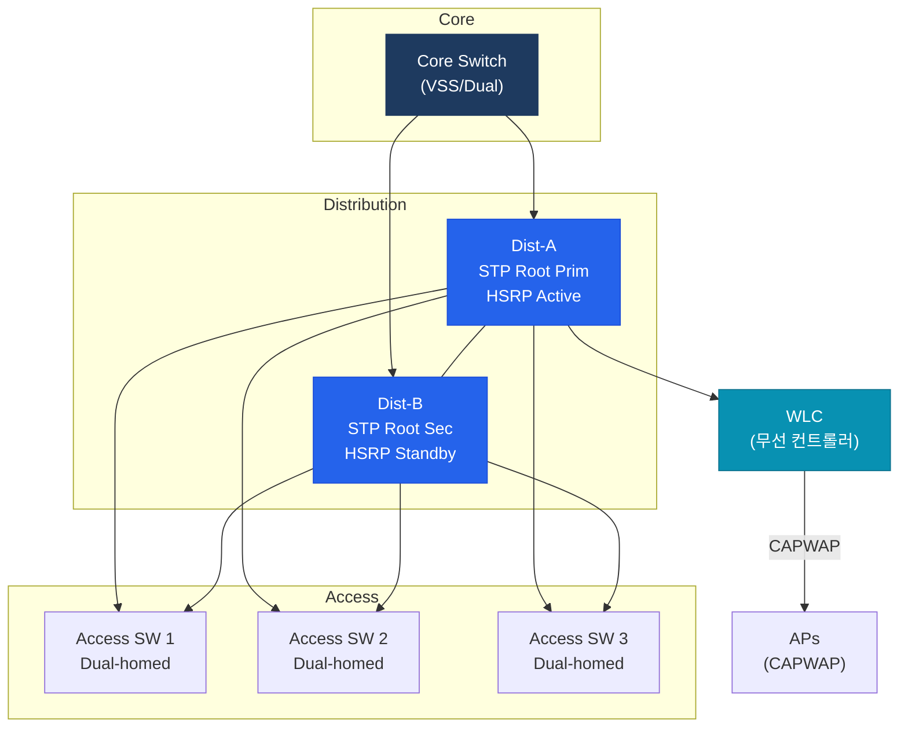

# 캠퍼스 네트워크 설계

## 정의

건물·캠퍼스 단위의 LAN 네트워크를 3계층 모델(Core/Distribution/Access)로 설계하는 아키텍처로, VLAN 분리·STP 최적화·FHRP 게이트웨이 이중화·무선 LAN 통합을 핵심 설계 요소로 포함한다.

## 특징

- **(VLAN 기반 트래픽 분리)** 데이터·음성·관리·게스트 VLAN을 분리하여 브로드캐스트 도메인을 제한하고 보안 정책을 계층별로 적용
- **(STP Root와 FHRP Active 일치)** Distribution 스위치에서 STP Root Bridge와 FHRP Active를 동일 장비로 일치시켜 트래픽의 서브옵티멀 경로를 방지
- **(VSS/StackWise로 STP 단순화)** 두 Distribution 스위치를 VSS(Virtual Switching System) 또는 StackWise로 논리적 단일 장비로 구성하여 STP 루프를 제거하고 L3 라우티드 포트로 운용

---

## 캠퍼스 설계 구조



---

## VLAN 설계 전략

| VLAN 유형 | 용도 | 권장 설정 |
|----------|------|---------|
| Data VLAN | PC·서버 트래픽 | VLAN 10~99 |
| Voice VLAN | IP 전화 | VLAN 100~199, QoS CoS 5 |
| Management VLAN | 장비 관리 (SSH) | VLAN 99 또는 별도 |
| Native VLAN | 태그 없는 트래픽 | 기본 VLAN 1 변경 권장 |
| Guest VLAN | 방문자 인터넷 | VLAN 200+, 인터넷만 허용 |

---

## STP + FHRP 연계 설계

```bash
! Distribution A — STP Primary Root + HSRP Active
DIST-A(config)# spanning-tree vlan 10,20,30 root primary    ! VLAN 10/20/30 Root
DIST-A(config)# spanning-tree vlan 40,50,60 root secondary  ! VLAN 40~60은 보조

DIST-A(config)# interface Vlan10
DIST-A(config-if)#  standby 10 priority 110
DIST-A(config-if)#  standby 10 preempt

! Distribution B — STP Secondary Root + HSRP Standby
DIST-B(config)# spanning-tree vlan 10,20,30 root secondary
DIST-B(config)# spanning-tree vlan 40,50,60 root primary    ! VLAN 40~60 부하 분산

! Access 스위치 — PortFast + BPDU Guard (단말 포트)
ACCESS(config)# interface range GigabitEthernet0/1-24
ACCESS(config-if-range)#  spanning-tree portfast
ACCESS(config-if-range)#  spanning-tree bpduguard enable

! 무선 LAN — FlexConnect (지사용)
WLC> config ap mode flexconnect AP-BRANCH
```

---

## 무선 통합 설계

| 방식 | 동작 | 적합 환경 |
|------|------|---------|
| Central Mode | AP가 WLC로 트래픽 터널 | 본사, 낮은 지연 링크 |
| FlexConnect | AP 로컬 스위칭, WLC 원격 관리 | 지사, WAN 링크 |
| Mesh | AP 간 무선 백홀 | 유선 설치 불가 환경 |

---

## CCNP/CCIE 시험 포인트

- **STP Root ≠ FHRP Active**: 트래픽이 비최적 경로(Suboptimal Path) → 반드시 일치
- VSS(Virtual Switching System): 두 Catalyst를 하나로 논리화 → STP 루프 제거, L3 포트 가능
- StackWise: Cisco Catalyst 스태킹 — VSS는 Sup 레벨, StackWise는 단일 엔클로저
- BPDU Guard: PortFast 포트에서 BPDU 수신 시 err-disabled 전환
- **CAPWAP**: AP-WLC 터널 프로토콜 (Control: UDP 5246, Data: UDP 5247)
- Native VLAN은 VLAN 1에서 변경 권장 (보안) — 양쪽 트렁크 포트 동일하게 설정
