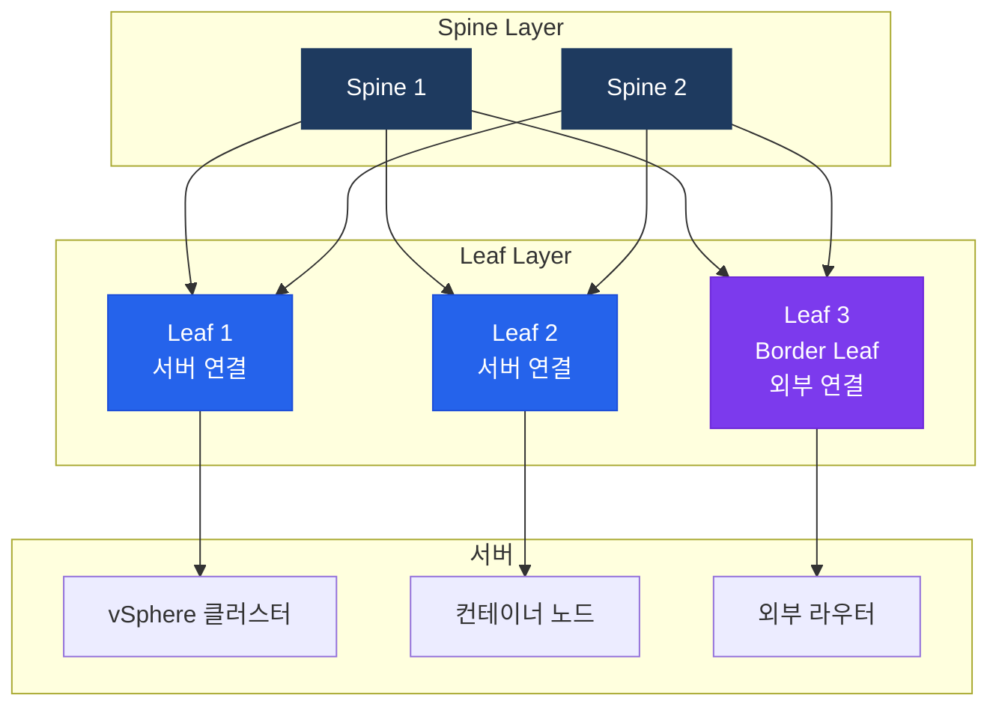

# 데이터센터 네트워크 설계

## 정의

서버·스토리지·가상화 환경을 연결하는 데이터센터 네트워크 아키텍처로, 전통적 3계층 모델에서 **Spine-Leaf 2계층 Fat-Tree** 로 진화하며 VXLAN 오버레이와 EVPN 컨트롤 플레인으로 L2/L3 확장성 문제를 해결한다.

## 특징

- **(Spine-Leaf 균일 지연)** 모든 Leaf가 모든 Spine에 연결되어 서버 간 최대 2홉 경로를 보장하고, Spine 추가만으로 대역폭을 선형 확장하여 East-West 트래픽 폭증에 대응
- **(VXLAN L2 over L3 확장)** MAC/IP를 UDP 4789로 캡슐화하여 L3 라우티드 패브릭 위에 L2 세그먼트를 확장함으로써 VLAN의 4094개 제한을 VNI 16M개로 극복
- **(EVPN 분산 컨트롤 플레인)** BGP EVPN이 MAC/IP/프리픽스를 MP-BGP로 배포하여 플러딩 없는 학습(BUM 트래픽 최소화)과 분산 게이트웨이(Anycast GW)를 실현

---

## 전통 3계층 vs Spine-Leaf 비교

| 구분 | 전통 3계층 | Spine-Leaf |
|------|----------|-----------|
| 홉 수 | 최대 6홉 | 최대 2홉 |
| 지연 | 불균일 | 균일 |
| 확장 | 수직 확장 | 수평 확장 (Spine 추가) |
| STP | 필요 (복잡) | 불필요 (IP Fabric) |
| 적합 트래픽 | North-South | East-West |

---

## Spine-Leaf 아키텍처



---

## VXLAN + EVPN 핵심 개념

| 개념 | 설명 |
|------|------|
| VNI (VXLAN Network Identifier) | 24비트, 최대 16M 세그먼트 (VLAN 4094 한계 극복) |
| VTEP (VXLAN Tunnel Endpoint) | VXLAN 캡슐화/역캡슐화 수행 (Leaf 스위치) |
| EVPN Type-2 | MAC+IP 광고 (학습 최적화) |
| EVPN Type-3 | BUM 트래픽 처리 (멀티캐스트 대체) |
| EVPN Type-5 | IP 프리픽스 광고 (L3 라우팅) |
| Anycast GW | 동일 IP/MAC을 모든 Leaf에 배포하여 로컬 게이트웨이 역할 |

---

## 설정 개요

```bash
! Leaf 스위치 VXLAN + EVPN (NX-OS)
feature nv overlay
feature vn-segment-vlan-based
feature bgp

! VTEP (NVE 인터페이스)
interface nve1
  no shutdown
  source-interface loopback1
  host-reachability protocol bgp

! VNI 매핑
vlan 10
  vn-segment 10010    ! VNI 10010 매핑
interface nve1
  member vni 10010
    ingress-replication protocol bgp

! EVPN BGP
router bgp 65001
  address-family l2vpn evpn
    neighbor SPINE activate
    advertise-pip         ! IP-VPN 광고

! Anycast Gateway
fabric forwarding anycast-gateway-mac 0000.2222.3333
interface Vlan10
  fabric forwarding mode anycast-gateway
  ip address 10.10.10.254/24

! 검증
NX-OS# show nve peers
NX-OS# show bgp l2vpn evpn summary
NX-OS# show mac address-table dynamic
```

---

## CCNP/CCIE 시험 포인트

- Spine-Leaf에서 Spine 간 연결 **금지** — 트래픽은 항상 Leaf→Spine→Leaf 경유
- VXLAN 헤더: UDP **4789** 포트, 8바이트 VXLAN 헤더 + 원본 L2 프레임
- **VTEP**: Leaf 스위치가 담당 — VXLAN 캡슐화/역캡슐화 포인트
- EVPN Type-2: **MAC+IP** 광고 — ARP 억제(Suppression) 지원
- Anycast GW MAC: 모든 Leaf에 **동일 MAC** 설정 → 로컬 게이트웨이 효과
- ACI(Application Centric Infrastructure): APIC 컨트롤러 + EPG/Contract 정책 모델
- Spine-Leaf는 **East-West 최적화** — North-South(인터넷)는 Border Leaf 경유
