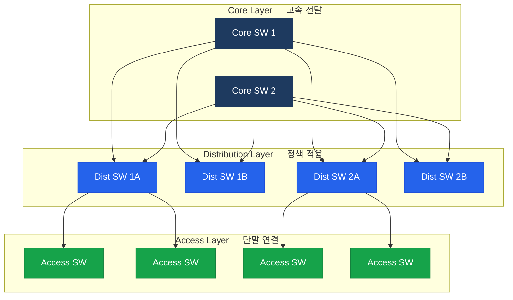

# 엔터프라이즈 네트워크 설계

## 정의

기업 규모의 네트워크를 기능별 계층으로 구분하여 설계하는 아키텍처로, Cisco는 **3계층 계층적 모델(Core/Distribution/Access)** 과 2계층 Collapsed Core 모델을 제시하며 모듈화 설계를 통해 확장성과 관리 용이성을 확보한다.

## 특징

- **(3계층 계층화)** Core(고속 전달)·Distribution(정책 적용)·Access(단말 연결) 계층으로 기능을 분리하여 각 계층의 변경이 타 계층에 미치는 영향을 최소화
- **(모듈화 설계)** 캠퍼스·WAN Edge·데이터센터·브랜치를 독립 모듈로 구성하여 모듈별 독립 확장과 장애 격리 가능
- **(이중화 내재화)** 모든 계층에서 링크·장비 이중화를 기본 설계 요소로 포함하여 단일 장애점(SPOF) 완전 제거

---

## Cisco 3계층 모델

---

## 계층별 역할

| 계층 | 주요 기능 | 권장 장비 | 프로토콜 |
|------|---------|---------|---------|
| Core | 고속 L3 스위칭, 최소 지연 | Catalyst 9500/9600 | OSPF/EIGRP |
| Distribution | ACL·QoS 정책, VLAN 경계, STP Root | Catalyst 9300/9500 | OSPF/EIGRP, HSRP |
| Access | 단말 연결, PoE, 802.1X, Port Security | Catalyst 9200/9300 | STP (포트 단위) |

---

## 3계층 vs 2계층(Collapsed Core) 비교

| 구분 | 3계층 | 2계층 (Collapsed Core) |
|------|------|----------------------|
| 규모 | 대기업 (수백~수천 포트) | 중소기업 (수십~수백 포트) |
| Core 존재 | 독립 Core 계층 | Distribution이 Core 겸임 |
| 비용 | 높음 | 낮음 |
| 확장성 | 우수 | 제한적 |
| 관리 복잡도 | 높음 | 낮음 |

---

## CCNP/CCIE 시험 포인트

- **Core 계층 역할**: 정책 적용 금지, 최소 지연·최대 처리량에 집중
- **Distribution 계층**: L2/L3 경계, STP Root 배치, FHRP Active 배치
- Collapsed Core 적용 기준: **~200대 이하** 접속 장비 또는 단일 빌딩
- **Spine-Leaf**: 데이터센터 전용 — 엔터프라이즈 캠퍼스에는 3계층 모델 적용
- 모든 계층 이중화 링크는 L2 EtherChannel 또는 L3 라우티드 포트
- VLAN pruning과 STP Root를 Distribution에 배치하여 트래픽 최적화
