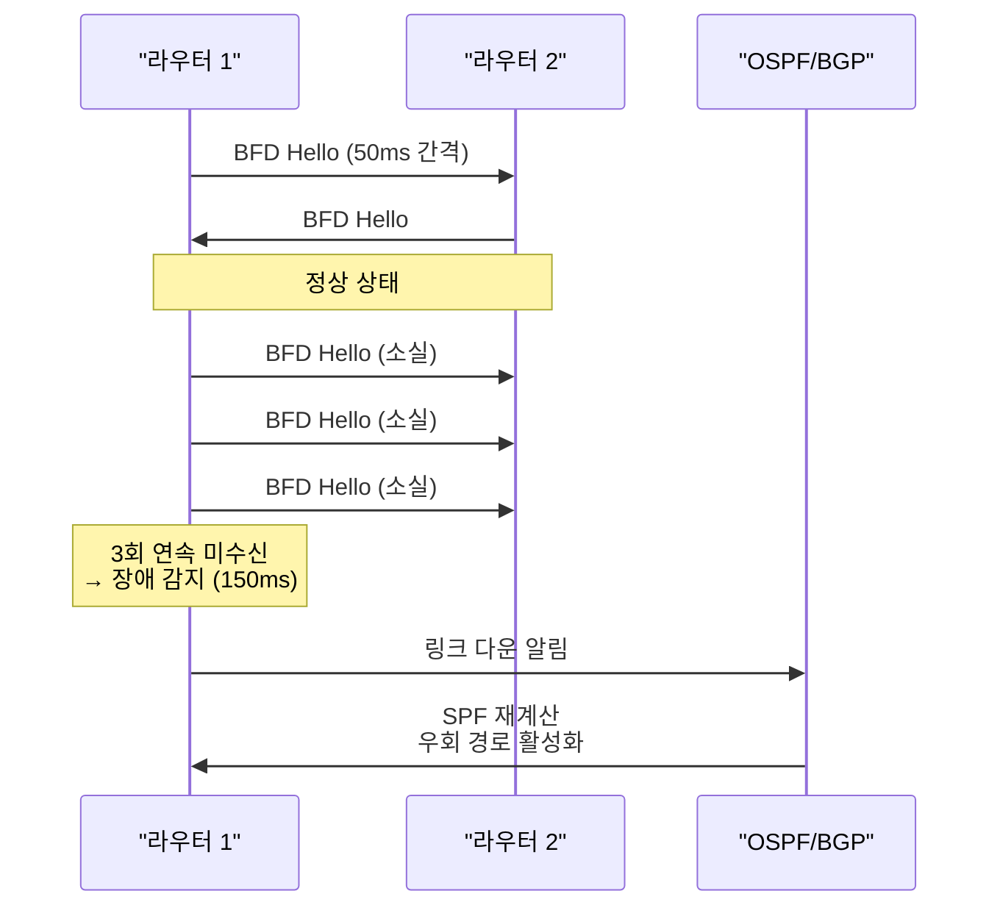

# 고가용성 (High Availability)

## 정의

네트워크 장애 시 서비스 중단을 최소화하기 위해 **이중화 장비·링크·경로**를 구성하고 NSF(Non-Stop Forwarding)·SSO(Stateful Switchover)·BFD 등의 기술로 컨트롤 플레인 재시작 중에도 데이터 플레인 포워딩을 유지하는 설계 원칙이다.

## 특징

- **(NSF/SSO 컨트롤 플레인 이중화)** 이중화 RP(Route Processor) 간 상태 동기화로 Active RP 장애 시 Standby RP가 즉시 인수하며 라우팅 테이블을 유지하여 포워딩 중단 없음
- **(BFD 고속 장애 감지)** 50~300ms 단위의 BFD(Bidirectional Forwarding Detection) 세션으로 라우팅 프로토콜의 Dead Timer(초 단위) 대비 수십 배 빠른 링크 장애 감지 및 절체
- **(이중화 토폴로지 설계)** Access-Distribution-Core 전 계층에서 Dual-homed 연결과 FHRP(HSRP/VRRP/GLBP)로 단일 장애점을 제거하여 99.999% 이상의 가용성 달성

---

## HA 핵심 지표

| 지표 | 정의 | 목표 |
|------|------|------|
| RTO (Recovery Time Objective) | 허용 서비스 복구 시간 | < 1초 (NSF/SSO) |
| RPO (Recovery Point Objective) | 허용 데이터 손실 시간 | 0 (상태 동기화) |
| MTBF (Mean Time Between Failures) | 평균 장애 간격 | 최대화 |
| MTTR (Mean Time To Repair) | 평균 복구 시간 | 최소화 |

---

## NSF / SSO / GR 비교

| 기술 | 대상 | 동작 | 효과 |
|------|------|------|------|
| SSO (Stateful Switchover) | RP 이중화 | Active/Standby RP 상태 동기화 | RP 전환 중 포워딩 유지 |
| NSF (Non-Stop Forwarding) | 라우팅 프로토콜 | 재시작 중 기존 FIB로 포워딩 | 라우팅 수렴 전까지 패킷 손실 없음 |
| GR (Graceful Restart) | BGP/OSPF/IS-IS | 재시작 사실을 피어에 알려 경로 유지 | 피어가 경로 삭제하지 않음 |

---

## BFD 동작



---

## 설정 및 검증

```bash
! === SSO 설정 ===
R(config)# redundancy
R(config-red)#  mode sso            ! SSO 모드 활성화
R# show redundancy states

! === NSF 설정 (OSPF) ===
R(config)# router ospf 1
R(config-router)#  nsf              ! NSF 활성화 (Cisco 방식)

! GR Helper (인접 라우터)
R(config)# router ospf 1
R(config-router)#  nsf enforce global  ! 글로벌 GR Helper 활성화

! === BFD 설정 ===
! 인터페이스에 BFD 활성화
R(config)# interface GigabitEthernet0/0
R(config-if)#  bfd interval 50 min_rx 50 multiplier 3
! 50ms 간격, 3회 미수신 = 150ms 후 장애 감지

! OSPF + BFD 연동
R(config)# router ospf 1
R(config-router)#  bfd all-interfaces    ! 모든 OSPF 인터페이스에 BFD

! BGP + BFD 연동
R(config)# router bgp 65001
R(config-router)#  neighbor 10.1.1.2 fall-over bfd

! 검증
R# show bfd neighbors
R# show bfd neighbors details
R# show redundancy states
R# show ip ospf nsf
```

---

## CCNP/CCIE 시험 포인트

- **NSF vs SSO**: SSO는 하드웨어 RP 전환, NSF는 라우팅 프로토콜 재시작 복구
- GR(Graceful Restart)는 **피어 라우터의 Helper 지원** 필요
- BFD 타이머: `interval [tx] min_rx [rx] multiplier [n]` — 장애 감지 = rx × multiplier
- BFD는 라우팅 프로토콜과 독립 — **라우팅이 없어도 BFD 세션 형성 가능**
- `redundancy mode sso`는 Supervisor 이중화 장비에서만 유효
- HSRP Preempt + Object Tracking: 업링크 다운 시 Priority 감소 → 자동 절체
- **Five Nines(99.999%)**: 연간 약 5.26분 다운타임 — NSF/BFD 조합으로 달성 가능
