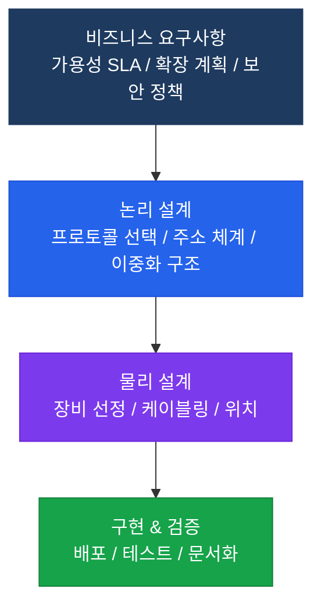

# 네트워크 설계 개요

## 정의

비즈니스 요구사항을 충족하는 네트워크 아키텍처를 체계적으로 계획하고 구현하는 엔지니어링 프로세스로, 확장성·가용성·보안·성능·관리 용이성을 균형 있게 고려하여 최적의 인프라를 설계하는 것이다.

## 특징

- **(계층화 모듈 설계)** 기능별 계층(Core/Distribution/Access)과 모듈(캠퍼스/WAN Edge/데이터센터)로 분리하여 변경 영향 범위를 최소화하고 장애 격리 및 독립적 확장 가능
- **(이중화 내재화)** 단일 장애점(SPOF) 제거를 위해 링크·장비·경로 이중화를 설계 초기부터 반영하여 장애 시 자동 전환으로 서비스 연속성 보장
- **(Top-Down 방법론)** 비즈니스 요구사항 → 논리 설계 → 물리 설계 순서로 진행하여 기술 중심이 아닌 비즈니스 목표 달성 중심의 설계 원칙 적용

## 왜 필요한가?

즉흥적으로 확장된 네트워크는 예측 불가능한 장애, 성능 병목, 보안 취약점을 내포한다. 체계적 설계는 **변경 용이성, 장애 격리, 확장성**을 보장하여 운영 비용과 다운타임을 최소화한다.

---

## 설계 원칙

---

## 섹션 내 문서

| 문서 | 내용 |
|------|------|
| [엔터프라이즈 설계](enterprise-design) | 3계층/2계층 모델, 모듈화 설계 |
| [고가용성](high-availability) | NSF/SSO, BFD, FHRP 설계 |
| [캠퍼스 설계](campus-design) | VLAN/STP/FHRP 배치, 무선 통합 |
| [데이터센터 설계](dc-design) | Spine-Leaf, VXLAN, ACI |

---

## CCNP/CCIE 시험 비중

| 시험 | 설계 비중 | 주요 출제 영역 |
|------|----------|--------------|
| ENCOR (350-401) | ~15% | 3계층 모델, 이중화, HA |
| ENARSI (300-410) | 낮음 | 라우팅 설계 |
| CCIE Enterprise | 높음 | 종합 설계 및 구현 |
