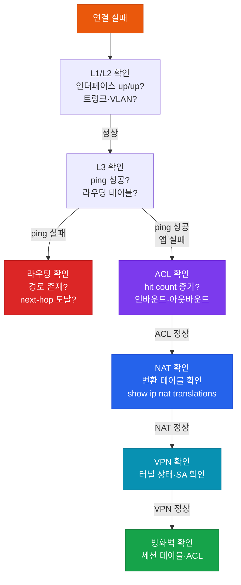

# 연결성 트러블슈팅

## 정의

엔드-투-엔드 네트워크 연결 실패를 OSI 계층 관점에서 체계적으로 진단하여 **ACL·NAT·VPN·방화벽·라우팅** 중 어느 요소가 트래픽을 차단하는지 특정하고 해결하는 방법론이다.

## 특징

- **(계층별 구간 분리)** 물리 → IP 연결 → 라우팅 → ACL → NAT → VPN 순서로 각 계층을 독립적으로 검증하여 복합 장애에서 차단 계층을 정확히 식별
- **(양방향 트래픽 확인)** 단방향 ping 성공이 연결 정상을 의미하지 않으며, 리턴 트래픽 경로와 ACL·NAT·방화벽의 반환 허용 여부를 반드시 별도 확인
- **(hit count 분석)** ACL의 permit/deny hit count 변화와 NAT 변환 테이블로 트래픽이 어느 지점까지 도달하는지 구간별 확인하여 차단 지점 특정

---

## 연결 실패 원인 분류



---

## ACL 트러블슈팅

```bash
! hit count 확인 (연결 시도 전후 비교)
R# show access-list OUTSIDE-IN
! deny 카운트 증가 → 해당 ACE에서 차단

! 인터페이스에 적용된 ACL 확인
R# show ip interface GigabitEthernet0/0
! Inbound access list: OUTSIDE-IN
! Outbound access list: not set

! 리턴 트래픽 차단 확인
! 예: TCP 80 허용했으나 응답 트래픽(반환 포트)을 차단한 경우
R(config)# ip access-list extended OUTSIDE-IN
R(config-ext-nacl)#  permit tcp any host 10.1.1.1 eq 80     ! 인바운드
R(config)# ip access-list extended INSIDE-OUT
R(config-ext-nacl)#  permit tcp host 10.1.1.1 any established  ! 리턴 허용

! ACL 로깅으로 차단 패킷 확인
R(config-ext-nacl)#  deny ip any any log
R# show logging | include denied
```

---

## NAT 트러블슈팅

```bash
! NAT 변환 테이블 확인
R# show ip nat translations
! Inside Local → Inside Global 변환 확인
! 변환 항목 없음 → ACL 매칭 실패 또는 NAT 설정 오류

! NAT 통계
R# show ip nat statistics
! Misses 증가 → 변환 실패 (ACL 미매칭)

! NAT 방향 확인
! ip nat inside — 내부 인터페이스
! ip nat outside — 외부 인터페이스
R# show ip interface GigabitEthernet0/0 | include NAT

! debug NAT (트래픽 확인 후 반드시 비활성화)
R# debug ip nat
R# debug ip nat detailed   ! 상세 (더 많은 출력)
R# undebug all             ! 반드시 비활성화

! 일반적인 NAT 실패 원인
! 1. overload 키워드 누락 (PAT)
! 2. ip nat inside/outside 인터페이스 방향 오류
! 3. ACL이 변환 대상 트래픽 미매칭
! 4. 라우팅 문제 (NAT 후 목적지 도달 불가)
```

---

## VPN 트러블슈팅

```bash
! IPsec 터널 상태 확인
R# show crypto isakmp sa         ! IKE Phase 1 SA
R# show crypto ipsec sa          ! IKE Phase 2 SA

! 패킷 카운터 확인
R# show crypto ipsec sa | include encaps|decaps|pkts
! encaps 증가, decaps 증가 → 정상 암호화/복호화
! encaps 증가, decaps 0 → 단방향 트래픽 (리턴 VPN 경로 문제)

! DMVPN 상태
R# show dmvpn
! State: IKE·ATM→UP → 정상
! NHRP 레지스트리
R# show ip nhrp detail

! IPsec 불일치 원인 확인
! Phase 1: 암호화·해시·DH 그룹·사전공유키 불일치
! Phase 2: Transform-set·PFS·ACL 불일치

R# debug crypto isakmp          ! Phase 1 협상
R# debug crypto ipsec           ! Phase 2 협상
R# undebug all
```

---

## 구간별 ping 테스트 방법

```bash
! 소스 인터페이스 지정 ping
R# ping 10.1.1.1 source GigabitEthernet0/0
R# ping 10.1.1.1 source Loopback0

! VRF 내 ping (MPLS VPN)
R# ping vrf CUSTOMER 10.1.1.1 source GigabitEthernet0/1

! 확장 ping (반복·크기·레코드 경로)
R# ping
Protocol [ip]:
Target IP address: 8.8.8.8
Repeat count [5]: 100
Datagram size [100]: 1400
Extended commands [n]: y
Source address or interface: Loopback0
Record route [n]:

! traceroute로 차단 구간 확인
R# traceroute 8.8.8.8 source Loopback0
! * * * = 해당 홉에서 ICMP TTL-exceeded 차단
```

---

## CCNP/CCIE 시험 포인트

- **ACL return 트래픽 차단**: TCP established 필터링 누락이 가장 흔한 함정
- NAT 처리 순서: **인바운드 라우팅 전** → NAT 변환 → 라우팅 결정 (Cisco IOS)
- IPsec `encaps 증가·decaps 0` → **리턴 터널 문제** (피어에서 SA 없음)
- DMVPN Spoke-to-Spoke 실패: Phase 확인 (Phase 1은 Hub 경유만, Phase 3은 직접)
- `ping` ICMP 차단 시 ACL test로 확인: `show access-list` hit count 변화
- VPN NAT-T(UDP 4500): 장비 또는 경로의 NAT가 ESP를 차단할 때 자동 활성화
- **양방향 경로 확인 필수**: 소스→목적지와 목적지→소스 경로 모두 확인
