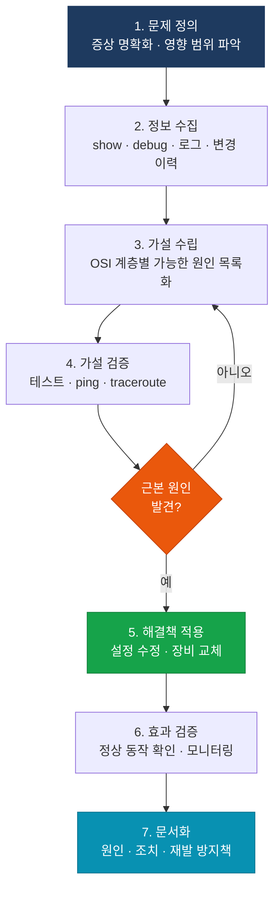

# 트러블슈팅 방법론

## 정의

네트워크 장애 발생 시 체계적인 문제 분석 프레임워크를 적용하여 **최단 시간 내에 근본 원인(Root Cause)** 을 파악하고 해결하는 엔지니어링 프로세스로, OSI 계층 모델을 기반으로 Top-Down·Bottom-Up·Divide-and-Conquer 접근법을 활용한다.

## 특징

- **(구조화 접근)** 직감이나 경험에만 의존하지 않고 OSI 계층별로 체계적으로 계층을 좁혀 나가므로 원인 파악 시간을 단축하고 시행착오를 최소화
- **(정보 수집 우선)** 문제 재현·증상 확인·변경 이력 확인을 먼저 수행하여 가설의 정확도를 높이고 불필요한 설정 변경으로 인한 2차 장애를 방지
- **(문서화와 재발 방지)** 해결 후 원인·조치·결과를 문서화하여 지식 기반을 구축하고 동일 장애의 재발을 방지

---

## 트러블슈팅 프로세스

---

## 3가지 접근 방법 비교

| 방법 | 시작 계층 | 적합 상황 |
|------|---------|---------|
| Top-Down | L7 → L1 | 애플리케이션 접속 오류, 전반적 원인 불명 |
| Bottom-Up | L1 → L7 | 물리 장애 의심, 새 설치 환경 |
| Divide-and-Conquer | L3 (ping) 시작 | 경험 기반, 중간부터 좁혀나감 |

---

## 섹션 내 문서

| 문서 | 내용 |
|------|------|
| [진단 도구](tools) | ping/traceroute/show/debug/SPAN/IP SLA |
| [L2 트러블슈팅](layer2-ts) | STP·VLAN·EtherChannel 장애 진단 |
| [라우팅 트러블슈팅](routing-ts) | OSPF·EIGRP·BGP 장애 진단 |
| [연결성 트러블슈팅](connectivity-ts) | NAT·ACL·VPN 연결 장애 진단 |

---

## CCNP/CCIE 시험 비중

| 시험 | 트러블슈팅 비중 | 주요 출제 영역 |
|------|--------------|--------------|
| ENCOR (350-401) | ~20% | 방법론, 진단 도구 |
| ENARSI (300-410) | ~35% | 라우팅 프로토콜 장애 진단 |
| CCIE Enterprise Lab | 50%+ | 실시간 장애 진단·해결 |
