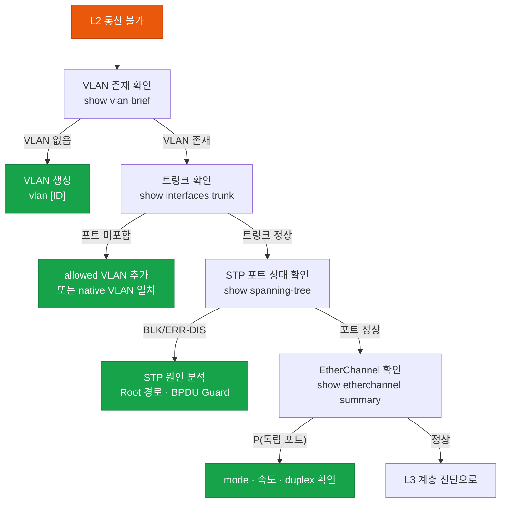

# L2 트러블슈팅

## 정의

데이터링크 계층(L2)의 스위칭 환경에서 발생하는 **STP 루프·VLAN 불일치·트렁크 미형성·EtherChannel 불일치** 등의 장애를 체계적으로 진단하고 해결하는 트러블슈팅 방법론이다.

## 특징

- **(계층 분리 진단)** VLAN → 트렁크 → STP → EtherChannel 순서로 L2 요소를 계층별로 확인하여 한 번에 하나의 요소를 검증함으로써 복합 장애에서 근본 원인을 빠르게 분리
- **(Hit Count 활용)** `show access-list` 의 hit count, `show spanning-tree detail` 의 변경 횟수로 장애가 현재 진행 중인지 과거 이슈인지 구분
- **(err-disabled 즉시 확인)** 포트가 err-disabled 상태면 BPDU Guard·Port Security·UDLD 등의 원인을 확인하고 원인 해결 후 `shutdown/no shutdown` 으로 복구

---

## L2 장애 진단 흐름



---

## 주요 장애 시나리오와 진단 명령어

### STP 관련 장애

```bash
! 브로드캐스트 스톰 / STP 루프
SW# show spanning-tree inconsistentports     ! 불일치 포트 확인
SW# show spanning-tree detail | include ieee|ieee|from|transitions
! 토폴로지 변경(TC) 횟수가 급증하면 루프 의심

! err-disabled 포트 확인
SW# show interfaces status err-disabled
SW# show interfaces GigabitEthernet0/1 status

! BPDU Guard 트리거된 경우
SW# show spanning-tree detail | include BPDU
SW(config)# interface GigabitEthernet0/1
SW(config-if)#  shutdown
SW(config-if)#  no shutdown    ! err-disabled 수동 복구
```

### VLAN / 트렁크 장애

```bash
! VLAN 존재 확인
SW# show vlan brief             ! VLAN ID, 이름, 포트 목록
SW# show vlan id 10             ! 특정 VLAN 상세

! 트렁크 포트 상태
SW# show interfaces trunk
! 주의: Native VLAN 불일치 → CDP 경고 + 트래픽 차단
SW# show interfaces GigabitEthernet0/1 trunk

! 트렁크 미형성 원인
SW# show interfaces GigabitEthernet0/1 switchport
! Administrative Mode / Operational Mode 확인
! dynamic auto vs dynamic auto → 트렁크 미형성!

! 수정: 한쪽은 trunk로 고정
SW(config-if)#  switchport mode trunk
SW(config-if)#  switchport trunk native vlan 999
SW(config-if)#  switchport trunk allowed vlan 10,20,30
```

### EtherChannel 장애

```bash
! EtherChannel 상태 확인
SW# show etherchannel summary
! 상태 코드: P=번들됨, I=독립, D=다운, H=핫-스탠바이

! 불일치 원인 확인 (속도/duplex/mode/VLAN 모두 일치해야 함)
SW# show etherchannel detail
SW# show interfaces GigabitEthernet0/1 etherchannel

! LACP 협상 상태
SW# show lacp neighbor
SW# show pagp neighbor

! 수정 예시 (LACP Active 설정)
SW(config)# interface range GigabitEthernet0/1-2
SW(config-if-range)#  channel-group 1 mode active    ! LACP Active
SW(config-if-range)#  speed 1000
SW(config-if-range)#  duplex full
```

---

## CCNP/CCIE 시험 포인트

- **Dynamic Auto + Dynamic Auto** = 트렁크 미형성 (둘 다 대기 상태)
- Native VLAN 불일치: CDP 경고 메시지 + 일부 트래픽 유실 (보안 취약점)
- EtherChannel 불일치 조건: 속도·duplex·VLAN·STP 설정·mode 모두 일치 필요
- `show spanning-tree inconsistentports`: Root Inconsistent = BPDU 수신 불일치 → 포트 차단
- UDLD(Unidirectional Link Detection): 단방향 링크 감지 → err-disabled
- err-disabled 자동 복구: `errdisable recovery cause [reason]` + `errdisable recovery interval`
- STP TC(Topology Change) 빈발: Portfast 미설정 포트에 PC/서버 연결 → 5초마다 TC 발생
