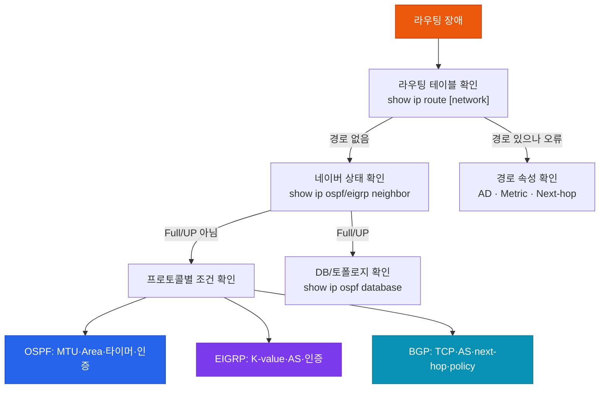

# 라우팅 트러블슈팅

## 정의

OSPF·EIGRP·BGP 등의 라우팅 프로토콜에서 발생하는 **네이버 미형성·경로 미수신·서브옵티멀 라우팅·재분배 루프** 문제를 OSI L3 관점에서 체계적으로 진단하고 해결하는 방법론이다.

## 특징

- **(네이버 먼저, 경로 나중)** 라우팅 문제는 항상 네이버 형성 → DB 동기화 → 최적 경로 선택 순서로 진단하며, 네이버 상태가 Full/Established가 아니면 경로 문제는 그 다음 단계
- **(프로토콜 고유 요구사항 확인)** OSPF는 MTU·Area·인증, EIGRP는 K-value·AS 번호, BGP는 TCP 연결·AS·next-hop이 핵심 조건이므로 프로토콜별 체크리스트를 적용
- **(show → debug 순서)** `show ip ospf neighbor` 등 show 명령어로 상태를 먼저 파악하고, 원인 불명 시에만 제한적 debug를 사용하여 CPU 부하 최소화

---

## 라우팅 장애 진단 흐름



---

## OSPF 트러블슈팅

```bash
! 1단계: 네이버 확인
R# show ip ospf neighbor
! 상태: FULL=정상, 2WAY=DR/BDR 미선출, EXSTART=MTU 불일치 의심

! 2단계: OSPF 인터페이스 파라미터 확인
R# show ip ospf interface GigabitEthernet0/0
! Hello/Dead 타이머, Area ID, 인증 타입, MTU 확인

! MTU 불일치 → ExStart에서 고착
R(config-if)#  ip ospf mtu-ignore    ! MTU 검사 무시 (임시 해결)
R(config-if)#  ip mtu 1500           ! MTU 값 일치 (근본 해결)

! 3단계: LSDB 확인
R# show ip ospf database             ! 전체 LSDB
R# show ip ospf database router      ! Type 1 LSA
R# show ip ospf database summary     ! Type 3 LSA (ABR 요약)

! 4단계: Stub area에서 Type 5 LSA 없는 경우
R# show ip ospf database external    ! Type 5 없으면 Stub area 의심
R(config-router)#  area 1 stub       ! 양쪽 모두 설정 필수

! debug (제한적 사용)
R# debug ip ospf events
R# debug ip ospf adj                 ! 인접 관계 형성 과정
```

---

## EIGRP 트러블슈팅

```bash
! 1단계: 네이버 확인
R# show ip eigrp neighbors
! Hold Time이 0에 가까우면 Hello 미수신 → 링크 또는 Hello 설정 문제

! 2단계: K-value 불일치 확인 (가장 흔한 원인)
R# show ip protocols
! K-values: K1=1 K2=0 K3=1 K4=0 K5=0 — 양쪽 동일해야 함
! K-value 불일치 → "EIGRP: K-value mismatch" 로그

! 3단계: 토폴로지 테이블 확인
R# show ip eigrp topology            ! Successor + Feasible Successor
R# show ip eigrp topology all-links  ! Active 상태 경로 포함

! SIA(Stuck-In-Active) 진단
R# show ip eigrp topology | include Active
! Active 상태가 오래 지속 → 쿼리에 응답 없는 라우터

! 4단계: 재배포 문제
R# show ip eigrp topology 0.0.0.0/0   ! Default route 확인
! EIGRP 외부 경로 AD = 170 (내부 90보다 높음)
```

---

## BGP 트러블슈팅

```bash
! 1단계: 피어 상태 확인
R# show bgp summary
! 상태: Established=정상, Idle=TCP 연결 실패, Active=연결 재시도 중

! 2단계: 연결 실패 원인
! Idle: ACL이 TCP 179 차단, 잘못된 neighbor IP
! Active: 연결 시도 중 — 피어가 응답 없음 (eBGP TTL=1 확인)
R(config-router)#  neighbor 10.1.1.1 ebgp-multihop 2  ! Loopback 사용 시

! 3단계: 경로 미수신
R# show bgp [prefix]
! > = 최적 경로, * = 유효, r = RIB-failure, s = suppressed

! Next-hop 도달 불가 (iBGP에서 흔함)
R(config-router)#  neighbor 10.1.1.1 next-hop-self  ! Next-hop 자신으로 변경

! 4단계: 경로 미광고
R# show bgp neighbors [IP] advertised-routes   ! 광고 중인 경로
R# show bgp neighbors [IP] received-routes     ! 수신한 경로
! route-map / prefix-list 필터 확인
R# debug ip bgp [IP] updates                  ! 업데이트 메시지 추적
```

---

## CCNP/CCIE 시험 포인트

- OSPF **MTU 불일치** → ExStart 상태에서 고착 (가장 흔한 함정)
- EIGRP **K-value 불일치** → 네이버 형성 불가 + 로그에 명시
- BGP **Idle 상태**: ACL, 잘못된 remote-as, TCP 179 차단 중 하나
- BGP **Active 상태**: TCP 연결 시도 중 — TTL/eBGP-multihop, 방화벽 확인
- iBGP `next-hop-self` 미설정 → 수신 경로의 next-hop이 iBGP 피어가 모르는 IP
- `show ip route` 에서 경로 없음 → AD가 더 낮은 다른 프로토콜이 같은 경로 설치 여부 확인
- 재배포 후 루프: AD 조정 + tag 기반 필터링으로 방지
