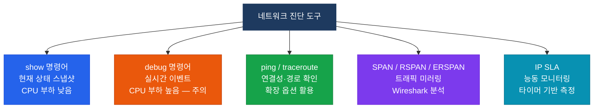

# 네트워크 진단 도구

## 정의

네트워크 장애를 진단하기 위해 사용하는 Cisco IOS 내장 명령어와 기능 집합으로, **show**(현재 상태 스냅샷)·**debug**(실시간 이벤트)·**ping/traceroute**(연결성 검증)·**SPAN**(패킷 캡처)·**IP SLA**(능동 모니터링)로 구분된다.

## 특징

- **(계층별 진단)** L1부터 L7까지 계층별 전용 show 명령어로 해당 계층의 상태를 빠르게 스냅샷 확인하여 문제 계층을 신속하게 좁혀나갈 수 있음
- **(실시간 이벤트 추적)** debug 명령어는 프로토콜 패킷·상태 전이·오류를 실시간으로 출력하나 **CPU 부하가 높으므로** 운영 장비에서는 신중하게 사용하고 반드시 비활성화
- **(능동·수동 모니터링 병행)** SPAN으로 실제 트래픽 패킷을 캡처하고 IP SLA로 정기적 ping/jitter 측정을 수행하여 간헐적 장애와 성능 저하를 선제 감지

---

## 진단 도구 분류



---

## 계층별 주요 show 명령어

| 계층 | 명령어 | 확인 내용 |
|------|--------|---------|
| L1 | `show interfaces [IF]` | 라인 상태, 오류 카운터 |
| L2 | `show mac address-table` | MAC 주소 테이블 |
| L2 | `show spanning-tree` | STP 포트 상태, Root Bridge |
| L2 | `show interfaces trunk` | 트렁크 허용 VLAN |
| L3 | `show ip interface brief` | IP 주소, 인터페이스 상태 |
| L3 | `show ip route [network]` | 라우팅 테이블 |
| L3 | `show ip arp` | ARP 테이블 |
| OSPF | `show ip ospf neighbor` | OSPF 네이버 상태 |
| BGP | `show bgp summary` | BGP 피어 상태, 경로 수 |
| ACL | `show access-list` | ACL hit count |
| NAT | `show ip nat translations` | NAT 변환 테이블 |

---

## 설정 및 검증

```bash
! === ping 확장 옵션 ===
R# ping 8.8.8.8 source Loopback0 repeat 100 size 1500
! source: 소스 IP 지정, repeat: 횟수, size: 패킷 크기

! === traceroute ===
R# traceroute 8.8.8.8 source GigabitEthernet0/0
R# traceroute 8.8.8.8 probe 5  ! 홉당 5개 프로브

! === SPAN (로컬 포트 미러링) ===
SW(config)# monitor session 1 source interface Gi0/1 both  ! 소스 포트
SW(config)# monitor session 1 destination interface Gi0/24  ! Wireshark 연결 포트

! === RSPAN (원격 포트 미러링) ===
SW1(config)# vlan 999
SW1(config-vlan)#  remote-span
SW1(config)# monitor session 1 source interface Gi0/1 both
SW1(config)# monitor session 1 destination remote vlan 999

SW2(config)# monitor session 2 source remote vlan 999
SW2(config)# monitor session 2 destination interface Gi0/24

! === IP SLA ===
R(config)# ip sla 1
R(config-ip-sla)#  icmp-echo 8.8.8.8 source-interface Loopback0
R(config-ip-sla-echo)#   frequency 10      ! 10초마다 측정
R(config)# ip sla schedule 1 life forever start-time now

! 검증
R# show ip sla summary
R# show ip sla statistics 1

! === debug (주의: CPU 부하) ===
R# debug ip ospf events          ! OSPF 이벤트
R# debug ip bgp 10.1.1.1 events  ! 특정 BGP 피어만
R# debug ip packet 100           ! ACL 100 매칭 패킷만 (필터 필수)
R# undebug all                   ! 모든 debug 비활성화 (필수!)
```

---

## CCNP/CCIE 시험 포인트

- `show interfaces` 에서 **input errors** (CRC) → L1 케이블 문제, **output drops** → 혼잡
- **debug는 반드시 `undebug all`로 비활성화** — 미비활성화 시 운영 장비 CPU 급등
- SPAN destination 포트는 **다른 트래픽 수신/전송 불가** — 전용 포트 필요
- ERSPAN: GRE(Protocol 47)로 패킷 미러링 — L3 네트워크 너머로 캡처 가능
- IP SLA `frequency` vs `timeout`: frequency는 측정 주기, timeout은 응답 대기 시간
- `ping` 실패 ≠ 연결 불가 — ACL·ICMP 차단 여부 별도 확인 필요
- `debug ip packet`은 **ACL 필터 없으면** 모든 패킷 출력 → 반드시 `access-list`로 필터링
